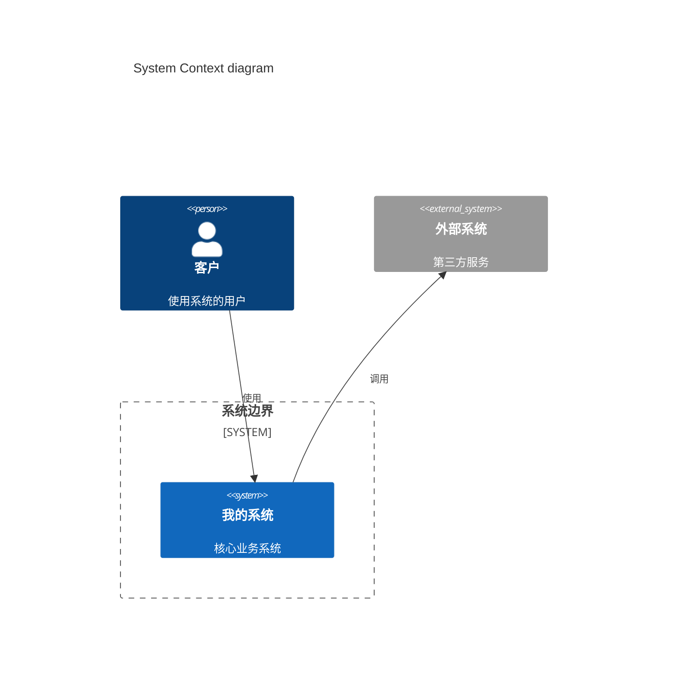
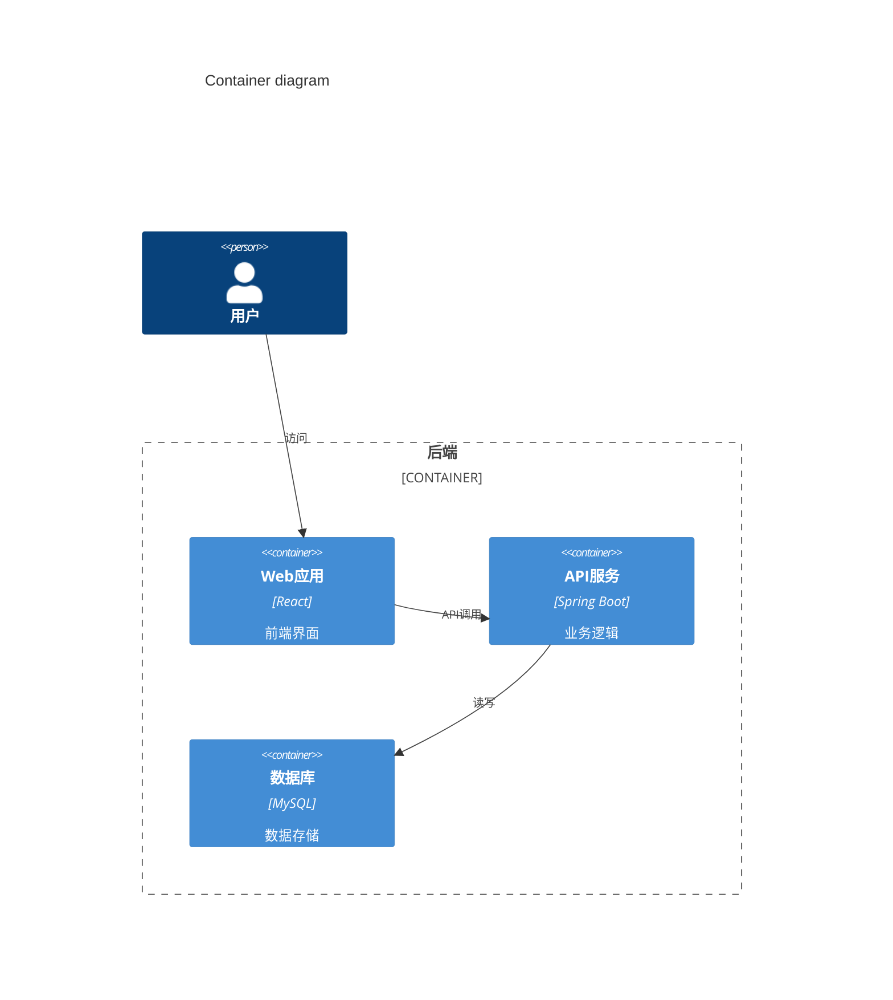
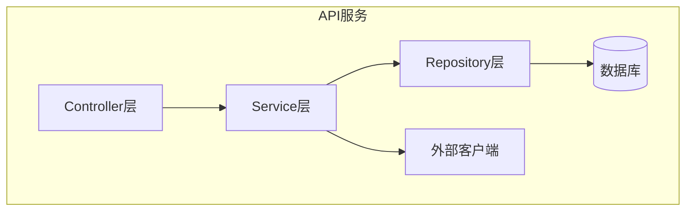
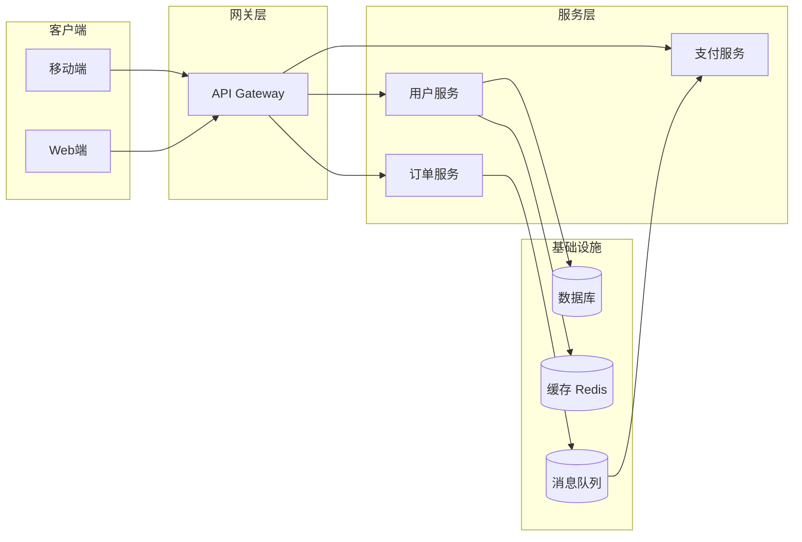

# Architecture Diagram Skill

根据用户需求绘制系统架构图，支持多种呈现风格和输出格式。

## 支持的工具

| 工具 | 适用场景 | 安装/运行 |
|------|---------|----------|
| Mermaid | 快速内嵌Markdown，流程图/时序图/架构图 | `npx -y @mermaid-js/mermaid-cli@latest` |
| D2 | 专业架构图，自动布局 | `npx -y @terrastruct/d2` |
| SVG | 完全自定义的静态架构图 | 无需依赖 |

## 工作流

1. 明确用户描述的架构层级和组件
2. 选择最合适的工具（默认Mermaid）
3. 生成图表代码
4. 使用对应工具渲染为图片（可选）
5. 保存到用户指定路径

## C4架构模型

C4模型从4个层次描述系统架构：

### Level 1: System Context（系统上下文图）

### Level 2: Container（容器图）

### Level 3: Component（组件图）

## 云架构图风格

### AWS风格
- 使用圆角矩形表示服务
- 分类颜色: 计算(橙色), 存储(绿色), 网络(紫色), 安全(红色), 集成(粉色)
- 使用AWS标准图标样式

### 通用微服务架构

## 最佳实践

1. 保持图表简洁，单个图表不超过15-20个节点
2. 分层绘制：先整体再局部
3. 使用颜色区分不同层级或模块
4. 标注关键协议（HTTP/gRPC/MQTT等）
5. 添加图例说明颜色和符号含义
6. 重要组件标注技术栈名称
