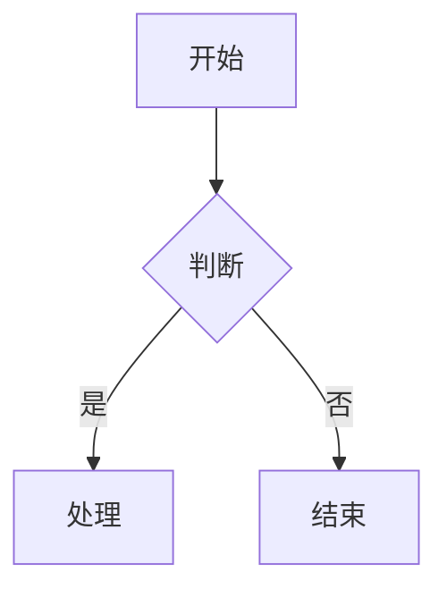
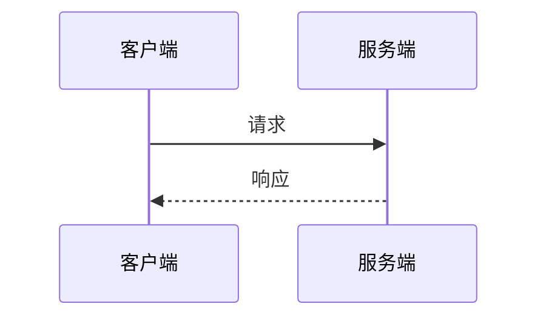
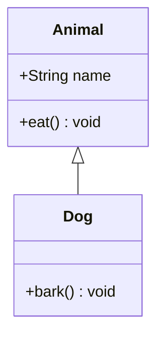
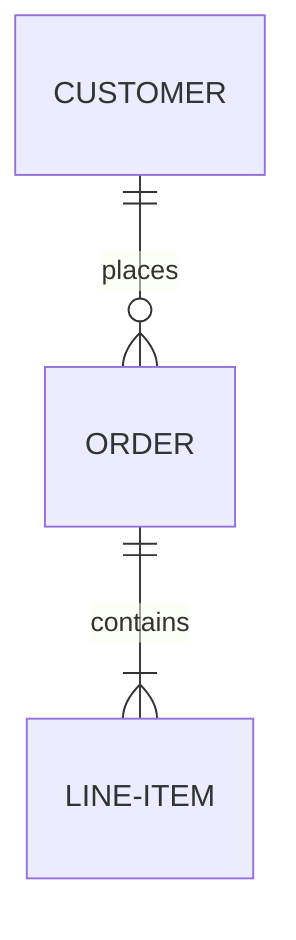
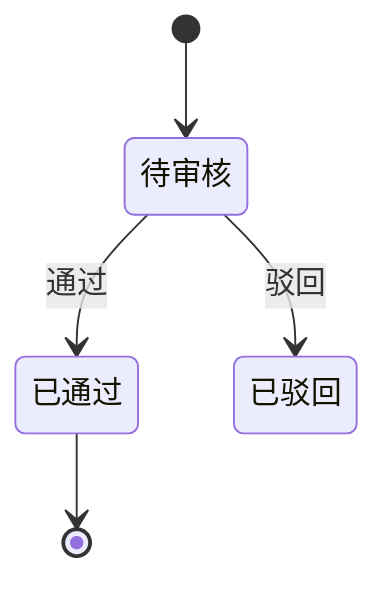
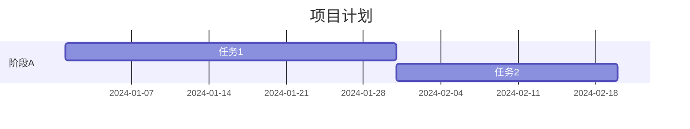
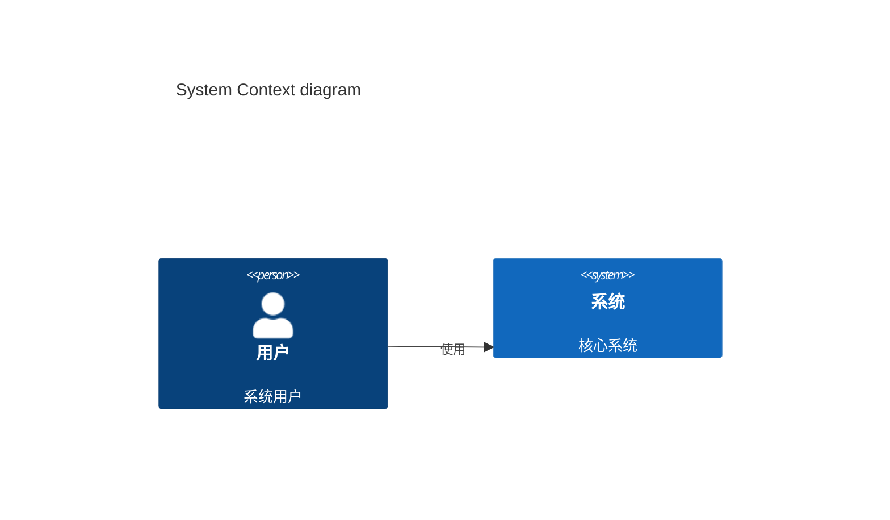

# Mermaid Diagram Skill

根据用户需求生成 Mermaid 图表代码，并渲染为可视化图片。

## 图表类型速查

| 图表类型 | Mermaid关键字 | 用途 |
|---------|--------------|------|
| 流程图 | graph / flowchart | 业务流程、算法逻辑 |
| 时序图 | sequenceDiagram | 交互流程、API调用 |
| 类图 | classDiagram | OO设计、领域模型 |
| 状态图 | stateDiagram-v2 | 状态机、工作流 |
| ER图 | erDiagram | 数据库设计 |
| 甘特图 | gantt | 项目排期 |
| 饼图 | pie | 数据占比 |
| 用户旅程图 | journey | 用户体验 |
| Git分支图 | gitGraph | Git工作流 |
| 象限图 | quadrantChart | 战略分析 |
| XY图表 | xychart | 数据可视化 |
| 思维导图 | mindmap | 头脑风暴 |
| 时间轴 | timeline | 时间线展示 |

## 工作流

1. 确认用户想要的图表类型和内容
2. 生成合法的 Mermaid 代码
3. 使用 `npx -y @mermaid-js/mermaid-cli@latest` 渲染为图片（可选，默认只输出代码块）
4. 将生成的图片保存到用户指定的路径

## Mermaid语法规范

### 流程图

方向: TB(从上到下), TD(同TB), BT(从下到上), RL(从右到左), LR(从左到右)
节点形状: `[矩形]`, `(圆角矩形)`, `{菱形}`, `>不对称]`, `((圆形))`

### 时序图

箭头: `->`(实线), `-->`(虚线), `->>`(实线带箭头), `-->>`(虚线带箭头)

### 类图

关系: `<|--`(继承), `*--`(组合), `o--`(聚合), `-->`(关联), `..|>`(实现)

### ER图

### 状态图

### 甘特图

### C4架构图

## 最佳实践

1. 节点ID使用有意义的英文命名
2. 复杂图表添加注释说明
3. 合理使用subgraph对节点分组
4. 优先使用 `graph TD` 方向
5. 中文内容需要确保渲染环境支持中文字体
