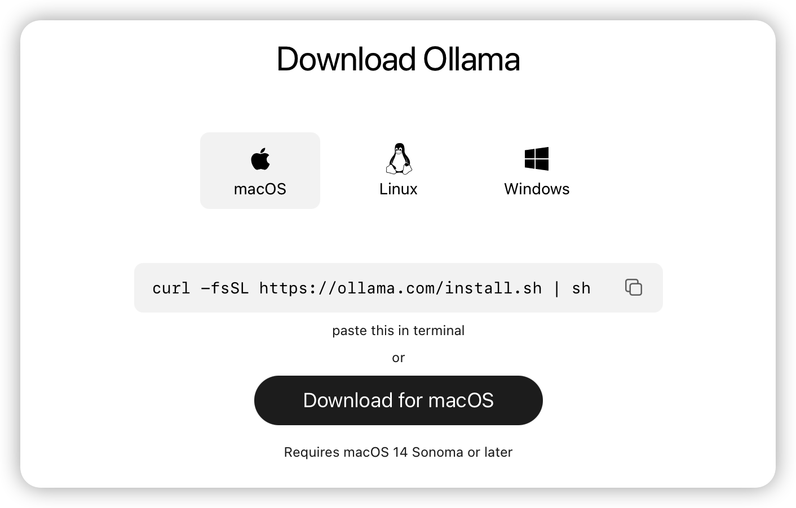
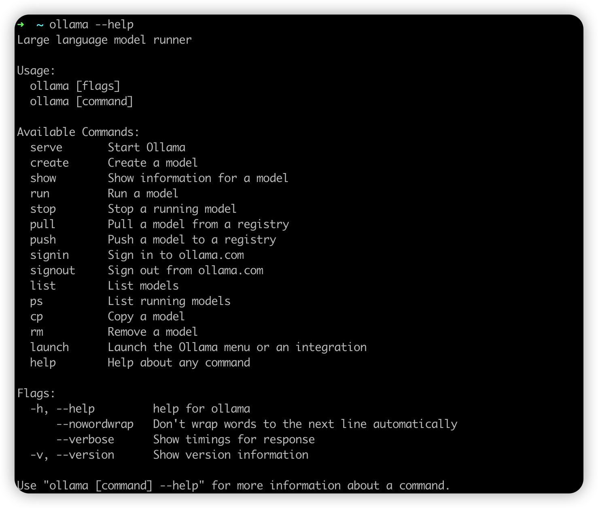
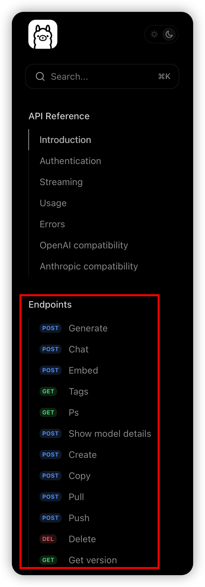

# Ollama
Ollama‌是一个‌开源跨平台大模型工具‌，旨在让用户轻松在本地运行、管理和部署大型语言模型

## 核心功能与特点
> **多种预训练语言模型支持**
> 
> Ollama提供市面上常见的大语言模型（GPT、KIMI等），可以让用户做到开箱即用
> 
> **易于集成和使用**
> 
> Ollama提供了命令行工具及SDK两种方式，使用者可以根据自身诉求来灵活选择
> 
> **本地部署与离线使用**
> 
> Ollama允许使用者在本地计算环境中运行模型，这与当前市面上大多依赖于云上模型不同，用户可以在本地使用且不需要担心数据安全问题

## 安装与使用
> **安装**
> 
> 可参考https://ollama.com/download根据自身服务环境进行对应安装
> 
> 
> **CLI使用**
> 
> 通过--help查看Ollama支持的命令
> 
> 
> **API使用**
>
> 当Ollama以serve运行时，可以通过RESTful请求进行访问，支持的功能可参考https://docs.ollama.com/api/introduction
> 