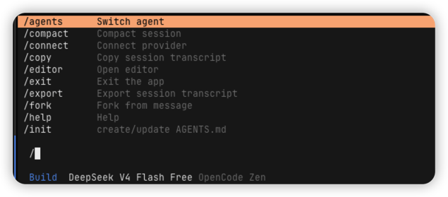
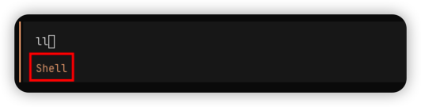
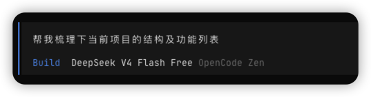

# OpenCode
OpenCode是一款开源的终端AI编程助手，允许开发者在CLI环境中直接调用AI完成代码编写、调试及重构任务

## 核心功能与特点
> * 双模式工作流：内置Plan（规划）与Build（构建）两种Agent模式，可通过Tab键快速切换
>   * Plan模式：只读权限，用于分析代码结构、规划改动，默认拒绝修改文件，适合探索未知项目
>   * Build模式：拥有完整全县，负责实际代码生成、编辑及工具调用
> * 多模型兼容：不绑定特定AI提供商，支持多种大语言模型，包括Claude、GPT、Gemini以及国内模型（DeepSeek）等
> * 终端原生体验：专为命令行设计，提供原生TUI界面，支持上下文感知，能自动扫描项目文件理解代码结构

## 安装及使用
### 安装
> 参考官方文档 https://opencode.ai/docs/zh-cn 即可完成。注意使用OpenCode前提条件（现代终端模拟器&要使用的LLM提供商的API密钥）

### 使用
使用opencode命令即可进入TUI界面
> **斜杠命令（/命令）**
> 
> 输入/可查看相应命令
> 
> 
>
> **Base命令（!命令）**
> 
> 输入!后，控制台会变为shell模式，在该模式下可以直接输入shell命令
> 
> 
> **输入**
> 在控制台输入对应内容，回车后，即可执行（注意，Build模式下会直接修改并生效，Plan模式下只会生成计划，不会发生变更）
> 

## Skills
Skills本质上就是让AI按照固定的流程来执行，可以封装成一个可以复用，可自动触发的能力模块。其以Markdown文件形式存在

### Skills、Prompt、MCP区别

|    | Prompt           | MCP                     | Skills              |
|:---|:-----------------|:------------------------|:--------------------|
| 本质 | 自然语言指令           | 预设的工具函数调用               | 动态扩展模型能力            |
| 能力 | 调用模型已有的知识        | 执行特定操作（读写文件、API调用、命令执行） | 实时访问外部数据源/工具        |
| 场景 | 一次性任务、简单逻辑、无外部依赖 | 重复性任务、需要系统交互、结构化输出      | 需要实时数据、专用工具集成、复杂工作流 |
| 优势 | 零成本、快速验证想法       | 可复用、自动化程度高              | 上下文感知、动态适应          |

### Skills结构
Skills的核心就是：**一个文件夹 + 一个SKILL.md 文件**。目录结构如下
```tree
xx-skill/
├── SKILL.md    ## 必需：指令+元数据
├── scripts/    ## 可选：可执行代码
├── references/ ## 可选：文档资料
└── assets/     ## 可选：模版、资源
```

SKILL.md基本模版
> `---`  
> name:Skill名称，最长64字符，智能使用小写字母、数字和-，且不能以-开头或结尾。  
> description:  
> `---`