# Java
本文只介绍相关概念，具体代码可参考https://github.com/Willem520/java-learning.git

## 对象内存布局
> 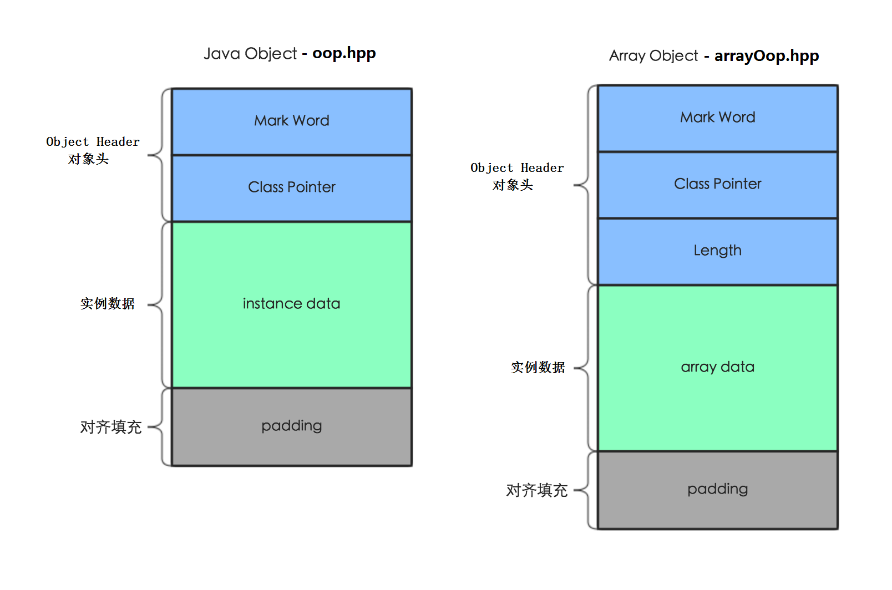
> * Mark Word：占用8字节，其内容是一系列的标记位，比如GC元数据、锁标记位等等
>     * 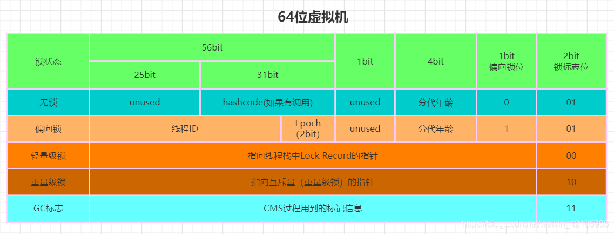
> * Klass(Class) Pointer：占用8字节（开启指针压缩占用4字节），指向类的元数据（属性、方法等），即Class对象
> * data：存储对象有效的实例数据，既我们在程序代码里面所定义的各种类型的字段内容，无论是从父类继承下来的，还是在子类中定义的都需要记录下来
> * padding：对齐填充指JVM将填充添加到对象末尾，以便它们的大小是8字节的倍数

## 类加载
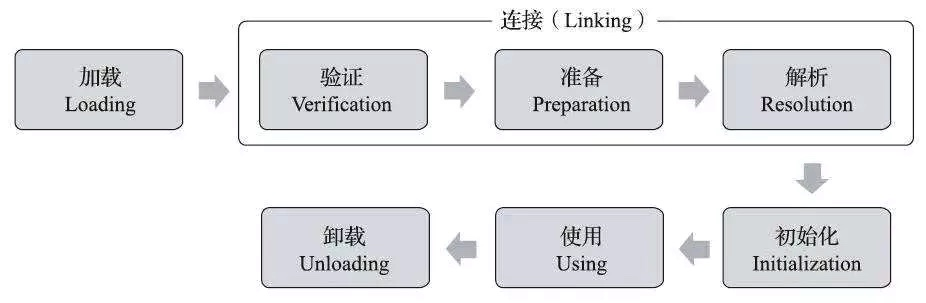
1. 加载 ：通过一个类的全限定名来获取定义此类的二进制字节流。将这个字节流所代表的静态存储结构转化为方法区的运行时数据结构。在内存中生成一个代表这个类的java.lang.Class对象，作为方法区这个类的各种数据的访问入口
2. 连接：把类的二进制数据合并到JRE中
   1. 验证：验证是否有正确的内部结构，并和其他类协调一致
   2. 准备：为类的静态成员分配内存，并设置默认初始化值
   3. 解析：将类的二进制数据中的符号引用替换为直接引用
3. 初始化：对类的静态变量，静态代码块执行初始化操作
4. 使用
5. 卸载

## 双亲委托
除了顶层的启动类加载器以外，其余的类加载器，在加载之前，都会委派给它的父加载器进行加载。这样一层层向上传递，直到祖先们都无法胜任，它才会真正的加载
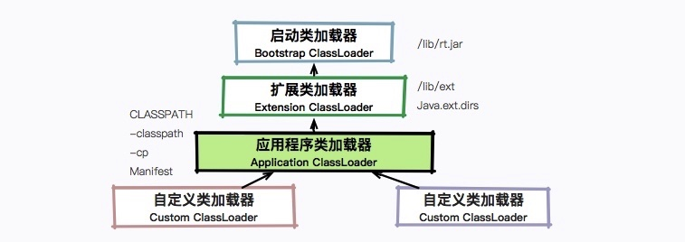
Java默认是这种行为，但是如SPI（JDBC驱动加载）、OSGI等并没有使用双亲委托

## JVM
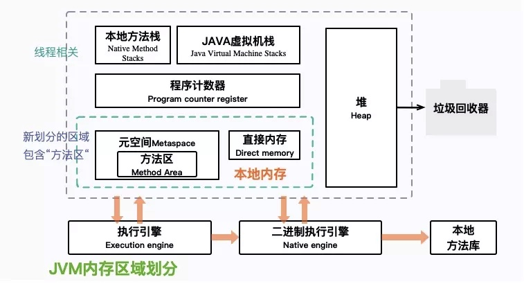
> 堆：JVM堆中的数据，是共享的，是占用内存最大的一块区域

> 虚拟机栈：Java虚拟机栈，是基于线程的，用来服务字节码指令的运行

> 程序计数器：当前线程所执行的字节码的行号指示器

> 元空间：方法区就在这里，非堆本地内存：其他的内存占用空间

### 方法调用
> invokestatic：用于调用静态方法  
> invokespecial：用于调用实例构造器()方法、私有方法和父类中的方法  
> invokevirtual：用于调用所有的虚方法  
> invokeinterface：用于调用接口方法，会在运行时再确定一个实现该接口的对象  
> invokedynamic：先在运行时动态解析出调用点限定符所引用的方法，然后再执行该方法  
> 前面4条调用指令，分派逻辑都固化在Java虚拟机内部，而invokedynamic指令的分派逻辑是由用户设定的引导方法来决定的

### 垃圾回收
可达性分析：引用计数法（无法解决相互引用）、根搜索算法
可作为GC Root的对象：
* 虚拟机栈中引用的对象（本地变量表） 
* 方法区中静态属性引用的对象
* 方法区中常量引用的对象 
* 本地方法栈中引用的对象（Native对象）

垃圾回收算法：
> **标记-清除**  
> 标记出存活的对象，然后回收未被标记的可回收对象的内部空间
> 
> 优点：标记-清除算法实现较容易，不需要移动对象  
> 缺点：算法过程需要暂停整个应用，效率不高，标记清除后会产生大量不连续的内存碎片，碎片太多可能会导致后续过程中需要为大对象分配空间时无法找到足够的空间而提前触发新的一次垃圾收集动作

> **复制**  
> 为了解决标志-清除算法的缺陷，由此有了复制算法。
> 复制算法将可用内存分为两块，每次只用其中一块，当这一块内存用完了，就将还存活着的对象复制到另外一块上面，然后再把已经使用过的内存空间一次性清理掉
> 
> 优点：实现简单，不易产生内存碎片，每次只需要对半个区进行内存回收
> 缺点：内存空间缩减为原来的一半；算法的效率和存活对象的数目有关，存活对象越多，效率越低

> **标记-整理**  
> 结合“标记-清除”和“复制”两个算法的优点。该算法标记阶段和“标志-清除”算法一样，但是在完成标记之后，它不是直接清理可回收对象，而是将存活对象都向一端移动，然后清理掉端边界以外的内存
> 

垃圾收集器  

> Serial(复制算法)：新生代单线程收集器，标记和清理都是单线程，优点是简单高效  
> Serial Old(标记-整理算法)：老年代单线程收集器，Serial收集器的老年代版本  
> 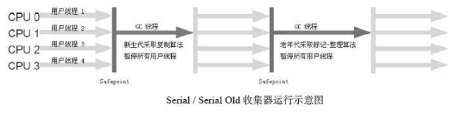

> ParNew(复制算法)：新生代收集器，Serial收集器的多线程版本，在多核CPU环境下有着比Serial更好的表现
> 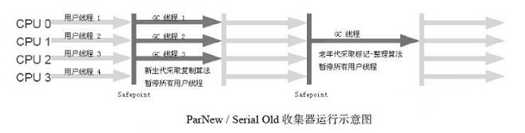

> Parallel Scavenge(复制算法)：并行收集器，追求高吞吐量，高效利用CPU。吞吐量一般为99%，吞吐量=用户线程时间/(用户线程时间+GC线程时间)。适合后台应用等对交互相应要求不高的场景
> Parallel Old(标记-整理算法)：Parallel Scavenge收集器的老年代版本，并行收集器，吞吐量优先
> 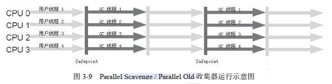

> CMS(标记-清除算法)：高并发、低停顿，追求最短GC回收停顿时间，CPU占用比较高，响应时间快，停顿时间短，多核CPU追求高响应时间的选择
> 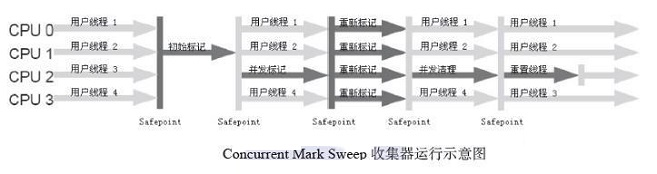  
> 过程：
> * 初始标记：仅仅只是标记一下GC Roots能直接关联到的对象，速度很快，需要STW
> * 并发标记：进行GC Roots Tracing的过程
> * 重新标记：修正并发标记期间因用户程序继续运作而导致标记产生变动的那一部分对象的标记记录，这个阶段的停顿时间一般会比初始标记阶段稍长一些，但远比并发标记的时间短，仍然需要STW
> * 并发清除：清除可回收对象  
> 缺点：对CPU资源非常敏感，无法处理浮动垃圾、产生大量空间碎片

> G1  
> 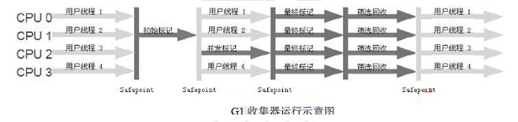
> 过程：
> * 初始标记：仅仅只是标记一下GC Roots能直接关联到的对象，并且修改TAMS(Next Top at Mark Start)的值，让下一阶段用户程序并发运行时，能在正确可用的Region中创建新对象，这阶段需要STW，但耗时很短
> * 并发标记：从GC Root开始对堆中对象进行可达性分析，找出存活的对象，这阶段耗时较长，但可与用户程序并发执行
> * 最终标记：修正在并发标记期间因用户程序继续运作而导致标记产生变动的那一部分标记记录，虚拟机将这段时间对象变化记录在线程Remembered Set Logs里面，最终标记阶段需要把Remembered Set Logs的数据合并到Remembered Set中，这阶段需要停顿线程，但是可并行执行
> * 筛选回收：对各个Region的回收价值和成本进行排序，根据用户所期望的GC停顿时间来制定回收计划，这个阶段其实也可以做到与用户程序一起并发执行，但是因为只回收一部分Region，时间是用户可控制的，而且停顿用户线程将大幅提高收集效率

jvm小工具
> * jps：主要用来输出JVM中运行的进程状态信息，语法如下：jps [options] [hostid]
> * jstat：用来查看GC
> * jmap：用来查看堆内存使用状况
> * jstack：主要用来查看某个Java进程内的线程堆栈信息，语法如下：jstack [option] pid
> * jhsdb：用来查看执行中的内存信息

## 锁
锁的状态从低到高依次为无锁=>偏向锁=>轻量级锁=>重量级锁，并且膨胀方向不可逆

### 锁概念
> * 独占锁：即其他线程只有在占有锁的线程释放后才能竞争锁，有且只有一个线程能竞争成功
> * 共享锁：即共享资源可以被多个线程同时占有，直到共享资源被占用完毕
> * 自旋锁：由于大部分时候，锁被占用的时间很短，共享变量的锁定时间也很短，所有没有必要挂起线程，用户态和内核态的来回上下文切换严重影响性能
> * 自适应锁：自适应锁就是自适应的自旋锁，自旋的时间不是固定时间，而是由前一次在同一个锁上的自旋时间和锁的持有者状态来决定
> * 锁消除：锁消除指的是JVM检测到一些同步的代码块，完全不存在数据竞争的场景，也就是不需要加锁，就会进行锁消除
> * 锁粗化：锁粗化指的是有很多操作都是对同一个对象进行加锁，就会把锁的同步范围扩展到整个操作序列之外
> * 偏向锁：当线程访问同步块获取锁时，会在对象头和栈帧中的锁记录里存储偏向锁的线程ID，之后这个线程再次进入同步块时都不需要CAS来加锁和解锁了，偏向锁会永远偏向第一个获得锁的线程，如果后续没有其他线程获得过这个锁，持有锁的线程就永远不需要进行同步，反之，当有其他线程竞争偏向锁时，持有偏向锁的线程就会释放偏向锁。可以用过设置-XX:+UseBiasedLocking=true开启偏向锁     
>     * 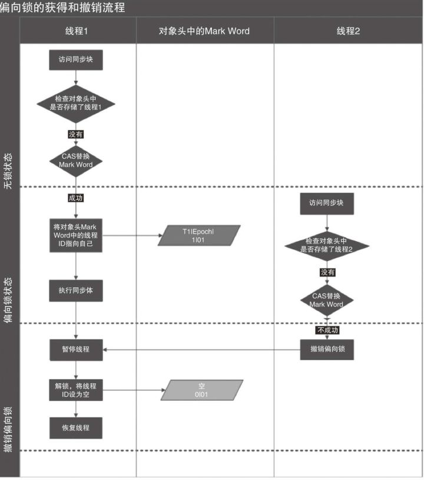
> * 轻量级锁：JVM的对象的对象头中包含有一些锁的标志位，代码进入同步块的时候，JVM将会使用CAS方式来尝试获取锁，如果更新成功则会把对象头中的状态位标记为轻量级锁，如果更新失败，当前线程就尝试自旋来获得锁
>     * 
> * 重量级锁：重量级锁会阻塞、唤醒请求加锁的线程。针对的是多个线程同时竞争同一把锁的情况。JVM采用自适应自旋，来避免在面对非常小的同步代码块时，仍会被阻塞和唤醒的状况

### 锁粗化过程
> 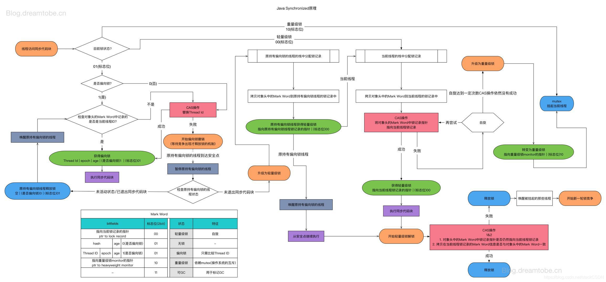
> * 一个对象刚开始实例化的时候，没有任何线程来访问它的时候。它是可偏向的，意味着，它现在认为只可能有一个线程来访问它，所以当第一个
线程来访问它的时候，它会偏向这个线程，此时，对象持有偏向锁。偏向第一个线程，这个线程在修改对象头成为偏向锁的时候使用CAS操作，并将
对象头中的ThreadID改成自己的ID，之后再次访问这个对象时，只需要对比ID，不需要再使用CAS在进行操作。
> * 一旦有第二个线程访问这个对象，因为偏向锁不会主动释放，所以第二个线程可以看到对象时偏向状态，这时表明在这个对象上已经存在竞争了，检查原来持有该对象锁的线程是否依然存活，如果挂了，则可以将对象变为无锁状态，然后重新偏向新的线程，如果原来的线程依然存活，则马上执行那个线程的操作栈，检查该对象的使用情况，如果仍然需要持有偏向锁，则偏向锁升级为轻量级锁，（偏向锁就是这个时候升级为轻量级锁的）。如果不存在使用了，则可以将对象回复成无锁状态，然后重新偏向。
轻量级锁认为竞争存在，但是竞争的程度很轻，一般两个线程对于同一个锁的操作都会错开，或者说稍微等待一下（自旋），另一个线程就会释放锁。 但是当自旋超过一定的次数（10次），或者一个线程在持有锁，一个在自旋，又有第三个来访时，轻量级锁膨胀为重量级锁，重量级锁使除了拥有锁的线程以外的线程都阻塞，防止CPU空转。

## ThreadPoolExecutor
### 流程
> 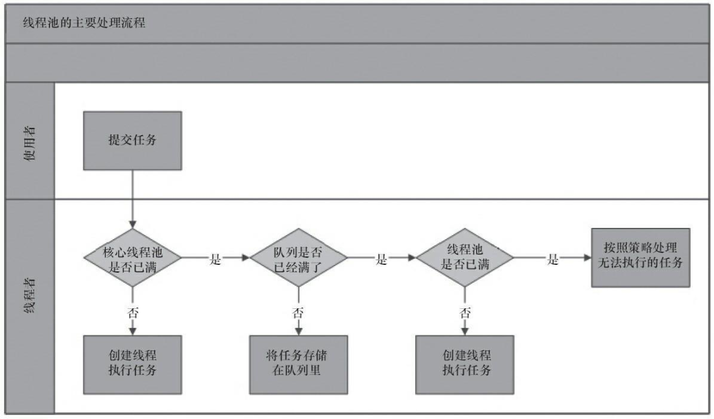

### RejectedExecutionHandler(拒绝策略)
> AbortPolicy：直接抛出异常  
> CallerRunsPolicy：使用调用者所在线程来运行任务  
> DiscardOldestPolicy：丢弃队列里最近的一个任务，并执行当前任务  
> DiscardPolicy：不处理，丢弃掉