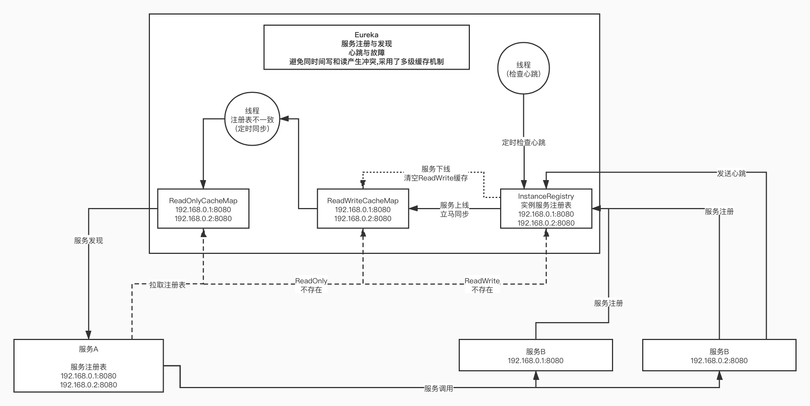

# Spring

## SpringCloud

### Eureka

工作流程：
1. Eureka Server启动成功，等待服务端注册。在启动过程中如果配置了集群，集群之间定时通过Replicate同步注册表，每个Eureka Server都存在独立完整的服务注册表信息
2. Eureka Client启动时根据配置的Eureka Server地址去注册中心注册服务
3. Eureka Client会每30s向Eureka Server发送一次心跳请求（续约），证明客户端服务正常
4. 当Eureka Server在90s内没有收到Eureka Client的心跳，注册中心则认为该节点失效，会注销该实例
5. 单位时间内Eureka Server统计到有大量的Eureka Client没有上报心跳，则认为可能为网络异常，进入自我保护机制，不再剔除没有上报心跳的客户端
6. 当Eureka Client心跳请求恢复正常之后，Eureka Server自动退出自我保护模式
7. Eureka Client定时全量或者增量从注册中心获取服务注册表，并且将获取到的信息缓存到本地
8. 服务调用时，Eureka Client会先从本地缓存找寻调取的服务。如果获取不到，先从注册中心刷新注册表，再同步到本地缓存
9. Eureka Client获取到目标服务器信息，发起服务调用
10. Eureka Client程序关闭时向 Eureka Server发送取消请求，Eureka Server将实例从注册表中删除

## Config
|对比项目/配置中心|config|apollo|nacos|
|-------|:---|:---|:---|
|开源时间|2014.9|2016.5|2018.6|
|配置实时推送|支持（Spring Cloud Bus）|支持（HTTP长轮询1s内）|支持（HTTP长轮询1s内）|
|版本管理|支持（Git）|自动管理|自动管理|
|配置回滚|支持（Git）|支持|支持|
|灰度发布|支持|支持|待支持|
|权限管理|支持|支持|待支持|
|多集群多环境|支持|支持|支持|
|监听查询|支持|支持|支持|
|多语言|只支持Java|Go,C++,Python,Java,.net,OpenAPI|Python,Java,Nodejs,OpenAPI|
|分布式高可用最小集群数量|Config-Server2+Git+MQ=4|Config2+Admin3+Portal*2+Mysql=8|Nacos*3+MySql=4|
|配置格式校验|不支持|支持|支持|
|通信协议|HTTP和AMQP|HTTP|HTTP|
|数据一致性|Git保证数据一致性，Config-Server从Git读取数据|数据库模拟消息队列，Apollo定时读消息|HTTP异步通知|

## Apollo

Apollo配置中心动态生效机制，是基于Http长轮询请求和Spring扩展机制实现的，在Spring容器启动过程中，Apollo通过自定义的BeanPostProcessor和BeanFactoryPostProcessor將参数中包含${…}占位符和@Value注解的Bean注册到Apollo框架中定义的注册表中。然后通过Http长轮询不断的去获取服务端的配置信息，一旦配置发生变化，Apollo会根据变化的配置的Key找到对应的Bean，然后修改Bean的属性，从而实现了配置动态生效的特性。
需要注意的是，Apollo在配置变化后，只能修改Bean的属性，例如我们数据源的属性发生变化，新创建的Connection对象是没问题的，但是连接池中已经创建的Connection对象相关信息是不能动态修改的，所以依然需要重启应用

## Zuul

工作流程：
1. http发送请求到zuul网关
2. zuul网关首先经过pre filter
3. 验证通过后进入routing filter，接着将请求转发给远程服务，远程服务执行完返回结果，如果出错，则执行error filter
4. 继续往下执行post filter
5. 最后返回响应给http客户端

## Hystrix

工作流程：
1. 每次调用都会创建HystrixCommand或者HystrixObservableCommand对象
2. 执行execute(observe)或queue(toObservable)做同步/异步调用
3. 检查请求结果是否被缓存,如果缓存直接返回
4. 检查是否开启了断路器，如果开启直接跳到步骤8
5. 检查线程池/信号量是否跑满，如果跑满进入步骤8
6. 执行HystrixObservableCommand.construct()或HystrixCommand.run()，如果执行异常或者调用超时直接跳到步骤8
7. 计算断路器状态,所有的运行状态(成功, 失败, 拒绝,超时)上报给断路器，用于统计从而判断断路器状态
8. 调用fallback降级机制，通过上述步骤会有（熔断器打开，线程池/信号量跑满，调用超时，调用失败）四种情况会进行降级处理
9. 返回依赖请求的真正结果

## Ribbon