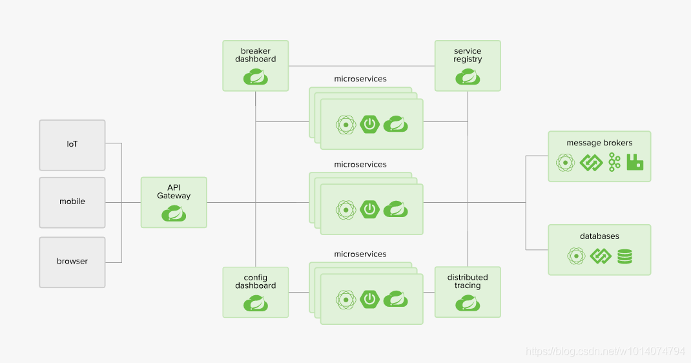
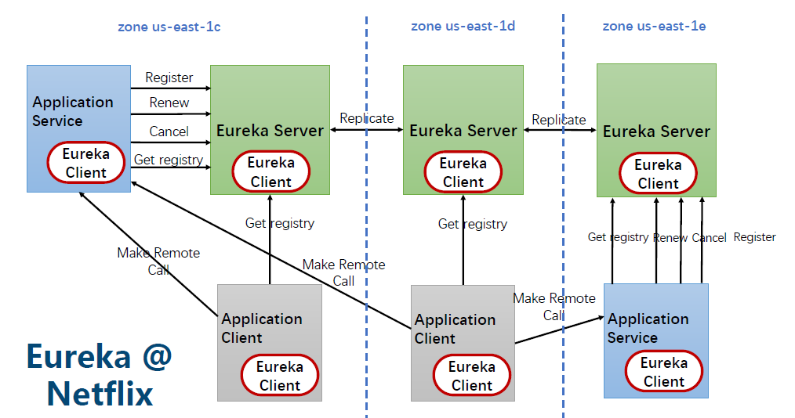
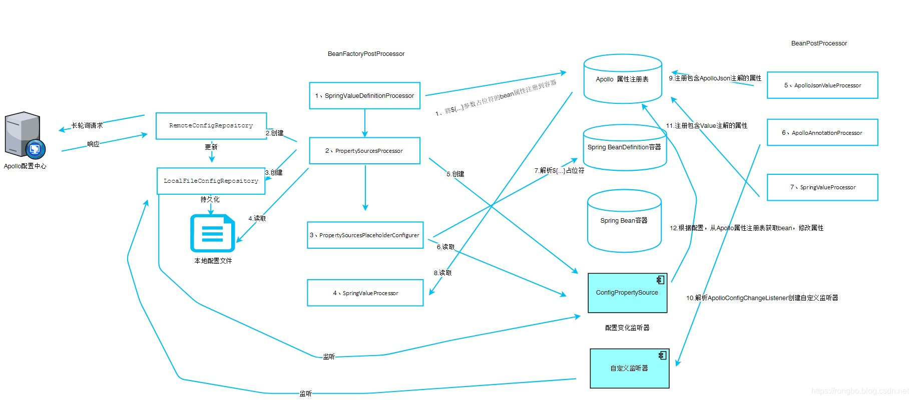
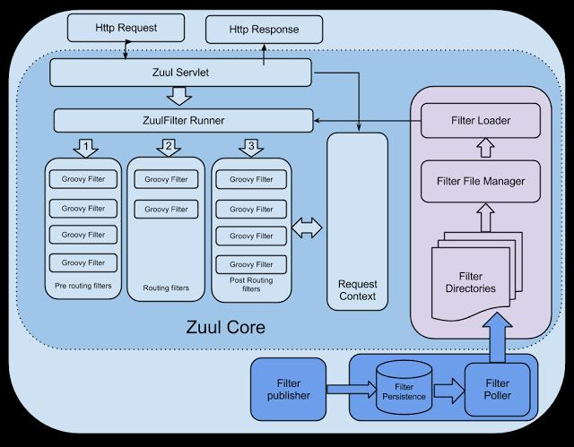
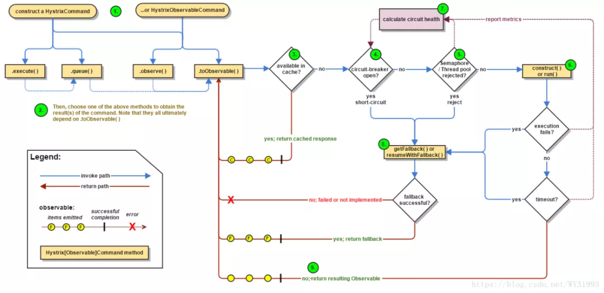

# Spring

# SpringCloud
Spring Cloud 为最常见的分布式系统模式提供了一种简单且易于接受的编程模型，帮助开发人员构建有弹性的、可靠的、协调的应用程序。Spring Cloud 构建于 Spring Boot 之上，使得开发者很容易入手并快速应用于生产中

## Eureka
Eureka是基于REST（代表性状态转移）的服务，以实现负载均衡和中间层服务器的故障转移

### 工作流程：
> 
> 1. Eureka Server启动成功，等待服务端注册。在启动过程中如果配置了集群，集群之间定时通过Replicate同步注册表，每个Eureka Server都存在独立完整的服务注册表信息
> 2. Eureka Client启动时根据配置的Eureka Server地址去注册中心注册服务
> 3. Eureka Client会每30s向Eureka Server发送一次心跳请求（续约），证明客户端服务正常
> 4. 当Eureka Server在90s内没有收到Eureka Client的心跳，注册中心则认为该节点失效，会注销该实例
> 5. 单位时间内Eureka Server统计到有大量的Eureka Client没有上报心跳，则认为可能为网络异常，进入自我保护机制，不再剔除没有上报心跳的客户端
> 6. 当Eureka Client心跳请求恢复正常之后，Eureka Server自动退出自我保护模式
> 7. Eureka Client定时全量或者增量从注册中心获取服务注册表，并且将获取到的信息缓存到本地
> 8. 服务调用时，Eureka Client会先从本地缓存找寻调取的服务。如果获取不到，先从注册中心刷新注册表，再同步到本地缓存
> 9. Eureka Client获取到目标服务器信息，发起服务调用
> 10. Eureka Client程序关闭时向 Eureka Server发送取消请求，Eureka Server将实例从注册表中删除

## Config
为分布式系统中的外部化配置提供服务器和客户端支持

|对比项目/配置中心|config|apollo|nacos|
|-------|:---|:---|:---|
|开源时间|2014.9|2016.5|2018.6|
|配置实时推送|支持（Spring Cloud Bus）|支持（HTTP长轮询1s内）|支持（HTTP长轮询1s内）|
|版本管理|支持（Git）|自动管理|自动管理|
|配置回滚|支持（Git）|支持|支持|
|灰度发布|支持|支持|待支持|
|权限管理|支持|支持|待支持|
|多集群多环境|支持|支持|支持|
|监听查询|支持|支持|支持|
|多语言|只支持Java|Go,C++,Python,Java,.net,OpenAPI|Python,Java,Nodejs,OpenAPI|
|分布式高可用最小集群数量|Config-Server2+Git+MQ=4|Config2+Admin3+Portal*2+Mysql=8|Nacos*3+MySql=4|
|配置格式校验|不支持|支持|支持|
|通信协议|HTTP和AMQP|HTTP|HTTP|
|数据一致性|Git保证数据一致性，Config-Server从Git读取数据|数据库模拟消息队列，Apollo定时读消息|HTTP异步通知|

## Apollo

Apollo配置中心动态生效机制，是基于Http长轮询请求和Spring扩展机制实现的，在Spring容器启动过程中，Apollo通过自定义的BeanPostProcessor和BeanFactoryPostProcessor將参数中包含${…}占位符和@Value注解的Bean注册到Apollo框架中定义的注册表中。然后通过Http长轮询不断的去获取服务端的配置信息，一旦配置发生变化，Apollo会根据变化的配置的Key找到对应的Bean，然后修改Bean的属性，从而实现了配置动态生效的特性。
需要注意的是，Apollo在配置变化后，只能修改Bean的属性，例如我们数据源的属性发生变化，新创建的Connection对象是没问题的，但是连接池中已经创建的Connection对象相关信息是不能动态修改的，所以依然需要重启应用

## Zuul 1.x
所有后端请求的前门。作为边界服务应用，ZUUL实现了动态路由、监视、弹性和安全性

### 工作流程
> 
> 1. http发送请求到zuul网关
> 2. zuul网关首先经过pre filter
> 3. 验证通过后进入routing filter，接着将请求转发给远程服务，远程服务执行完返回结果，如果出错，则执行error filter
> 4. 继续往下执行post filter
> 5. 最后返回响应给http客户端

## Gateway

### 工作流程
> 
> 1. Gateway的客户端会向SpringCloud Gateway发起请求，请求被HttpWebHandlerAdapter进行提取组装成网关的上下文，然后传递到DispatcherHandler
> 2. DispatcherHandler主要负责分发请求对应的处理器，比如将请求分发到对应RoutePredicateHandlerMapping(路由断言处理器映射器） 
> 3. RoutePredicateHandlerMapping路由断言处理映射器主要用于路由的查找，以及找到路由后返回对应的FilteringWebHandler
> 4. FilteringWebHandler组装Filter链表并调用Filter执行一系列Filter处理，然后把请求转到后端对应的代理服务处理，处理完毕后，将Response返回到Gateway客户端

|对比项目/网关|Zuul 1.x|Gateway|
|-------|:---|:---|
|实现|基于Servlet2.x构建，使用阻塞的API|基于Spring5、Project Reactor、SpringBoot2、使用非阻塞的API|
|长连接|不支持|支持|
|不适用场景|后端服务响应慢或者高并发场景下，因为线程数量是有限的，线程容易被耗尽，导致新请求被拒绝|中小流量项目，使用Zuu1.x更适合|
|限流|无|内置限流过滤器|
|上手难度|同步编程，上手简单|门槛较高，上手难度中等|
|SpringCloud集成|是|是|
|Sentinel集成|是|是|

## Hystrix
通过添加等待时间容限和容错逻辑来帮助您控制这些分布式服务之间的交互。Hystrix通过隔离服务之间的访问点，停止服务之间的级联故障并提供后备选项来实现此目的，所有这些都可以提高系统的整体弹性

### 工作流程
> 1. 每次调用都会创建HystrixCommand或者HystrixObservableCommand对象
> 2. 执行execute(observe)或queue(toObservable)做同步/异步调用
> 3. 检查请求结果是否被缓存,如果缓存直接返回
> 4. 检查是否开启了断路器，如果开启直接跳到步骤8
> 5. 检查线程池/信号量是否跑满，如果跑满进入步骤8
> 6. 执行HystrixObservableCommand.construct()或HystrixCommand.run()，如果执行异常或者调用超时直接跳到步骤8
> 7. 计算断路器状态,所有的运行状态(成功, 失败, 拒绝,超时)上报给断路器，用于统计从而判断断路器状态
> 8. 调用fallback降级机制，通过上述步骤会有（熔断器打开，线程池/信号量跑满，调用超时，调用失败）四种情况会进行降级处理
> 9. 返回依赖请求的真正结果

## Ribbon
一个客户端/进程内负载均衡器，运行在消费者端
### 工作流程
> 
> 1. 通过ServerList从配置文件或者注册中心获取服务节点列表信息
> 2. 某些情况下我们可能需要通过通过ServerListFilter按照指定策略过滤服务节点列表
> 3. 为了避免每次都要去注册中心或者配置文件中获取服务节点信息，我们会将过滤后的服务列表信息存到本地内存。此时如果新增服务节点或者是下线某些服务时，我们需要通过ServerListUpdater来动态更新服务列表
> 4. 当有些服务节点已经无法提供服务后，我们会通过IPing（心跳检测）来剔除服务ribbon
> 5. 最后ILoadBalancer 接口通过IRule指定的负载均衡算法去服务列表中选取一个服务

### 负载均衡策略
|策略|策略描述|实现说明|
|-------|:---|:---|
|AvailabilityFilteringRule|先过滤掉由于多次访问故障而处于断路器状态的服务，还有并发的连接数量（active connections）超过阈值的服务，然后对剩余的服务列表按照轮询策略进行访问|使用一个AvailabilityPredicate来包含过滤server的逻辑，其实就就是检查status里记录的各个server的运行状态|
|BestAvailableRule|先过滤掉由于多次访问故障而处于断路器跳闸状态的服务，然后选择一个并发量最小的服务|逐个考察Server，如果Server被tripped了，则忽略，在选择其中ActiveRequestsCount最小的server|
|ZoneAvoidanceRule|综合判断Server所在区域的性能和Server的可用性选择服务器|使用ZoneAvoidancePredicate和AvailabilityPredicate来判断是否选择某个server，前一个判断判定一个zone的运行性能是否可用，剔除不可用的zone（的所有server），AvailabilityPredicate用于过滤掉连接数过多的Server|
|RandomRule|随机选择一个服务|在index上随机，选择index对应位置的server|
|RetryRule|对选定的负载均衡策略机上重试机制|在一个配置时间段内当选择server不成功，则一直尝试使用subRule的方式选择一个可用的server|
|RoundRobinRule|roundRobin方式轮询选择server|轮询index，选择index对应位置的server|
|WeightedResponseTimeRule|根据响应时间分配一个weight，响应时间越长，weight越小，被选中的可能性越低|一个后台线程定期（30s）从status里面读取评价响应时间，为每个server计算一个weight（responsetime减去每个server自己平均的responsetime）。当刚开始运行没有形成status时，使用RoundRobinRule，等统计信息足够，会切换|

## Fegin
运行在消费者端的，使用 Ribbon 进行负载均衡
