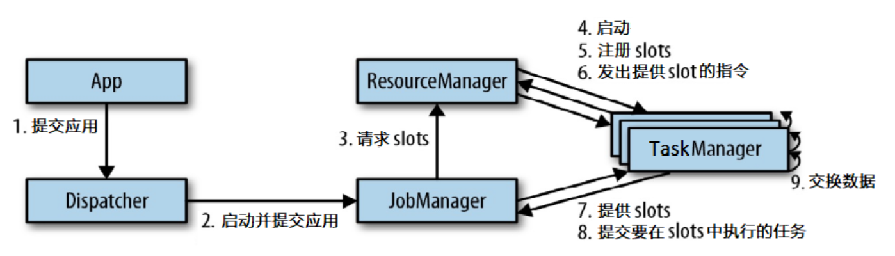

# Flink

Apache Flink 是一个框架和分布式处理引擎，用于对无界和有界数据流进行有 状态计算。Flink 被设计在所有常见的集群环境中运行，以内存执行速度和任意规模 来执行计算

## 基本概念
> * JobManager（作业管理器）：应用程序执行的主进程，向ResourceManager申请执行的资源（即TaskMaster的slot），并分发Task。负责所有需要中央协调的操作（如：checkpoint）
> * ResourceManager（资源管理器）：主要负责管理TaskMaster的slot
> * TaskManager（任务管理器）：向TaskManager注册slot
> * Dispatcher（分发器）：可以跨作业运行，当应用被提交执行时，分发器就会启动并将应用移交给一个JobManager

## 流程

## 部署方式
> * Standalone
> * Flink on YARN
> * Flink on k8s