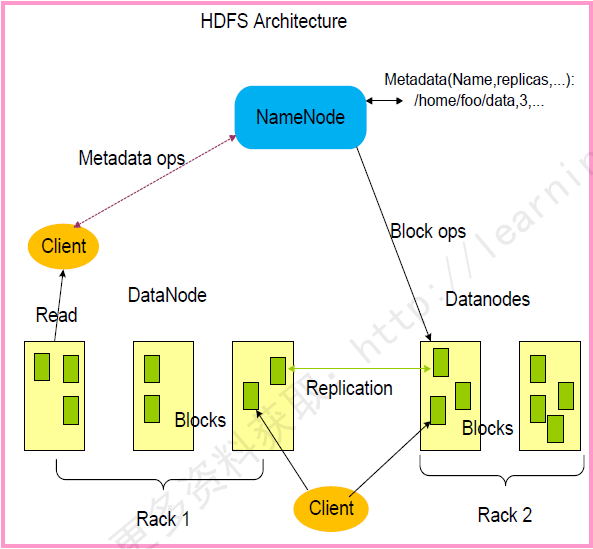
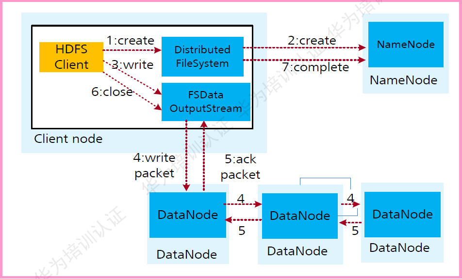
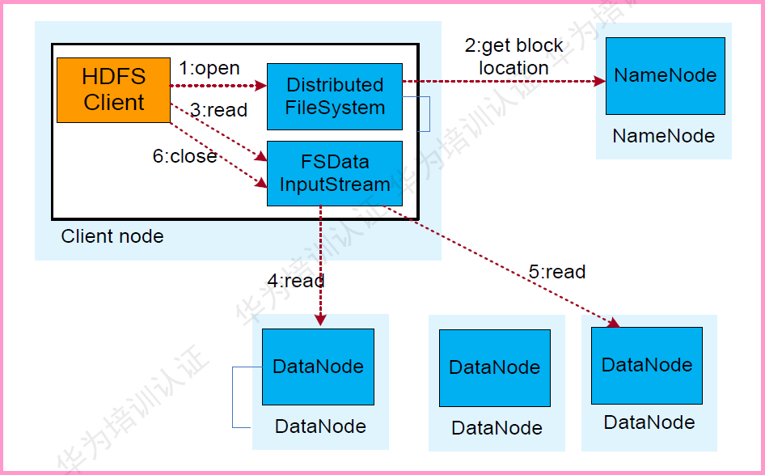
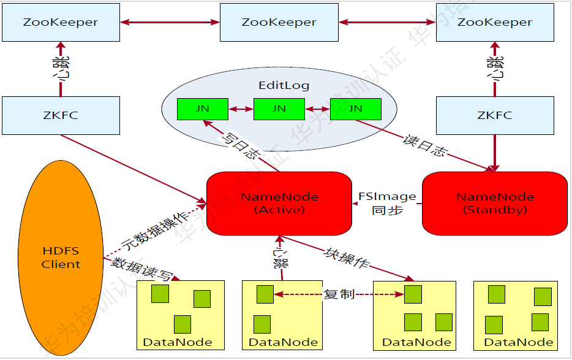

# HDFS
HDFS(Hadoop Distributed File System)基于Google发布的GFS论文设计开发，运行在通用硬件平台上的分布式文件系统  

## 基本概念
> * NameNode：用于存储、生成文件系统的元数据、运行一个实例
>     * FsImage：用于维护文件系统树以及文件树中所有的文件和文件夹的元数据
>     * EditLog：记录了所有针对文件的创建、删除、重命名等操作
> * DataNode：用于存储实际的数据，将自己管理的数据块上报给NameNode，运行多个实例
> * Client：支持业务访问HDFS，从NameNode，DataNode获取数据返回给业务。多个实例，和业务一起运行

## 写入流程
> 
> 1. 业务应用调用HDFS Client提供的API创建文件，请求写入
> 2. HDFS Client联系NameNode，NameNode在元数据中创建文件节点
> 3. 业务应用调用write API写入文件
> 4. HDFS Client收到业务数据后，从NameNode获取到数据块编号、位置信息后，联系DataNode，并将要写入数据的DataNode建立起流水线。完成后，客户端再通过自有协议写入数据到DataNode1，再由DateNode1复制到NataNode2，DataNode3
> 5. 写完的数据，将返回确认信息给HDFS Client
> 6. 所有数据确认完成后，业务调用HDFS Client关闭文件
> 7. 业务调用close，flush后HDFS Client联系NameNode，确认数据写完成，NameNode持久化元数据

## 读取流程
> 
> 1. 业务调用HDFS Client提供的API打开文件
> 2. HDFS Client联系NameNode，获取到文件信息（数据块、DataNode位置信息）
> 3. 业务应用调用read API读取文件
> 4. HDFS Client根据从NameNode获取到的信息，联系DataNode，获取相应的数据块。（Client采用就近原则读取数据）
> 5. HDFS Client会与多个DataNode通讯获取数据块
> 6. 数据读取完成后，业务调用close关闭连接

## 集群HA

> 工作流程
> 1. SecondaryNameNode会定期和NameNode通信，请求其停止使用EditLog文件，暂时将新的写操作写到一个新的文件edit.new上来，这个操作是瞬间完成，上层写日志的函数完全感觉不到差别；
> 2. SecondaryNameNode通过HTTP GET方式从NameNode上获取到FsImage和EditLog文件，并下载到本地的相应目录下；
> 3. SecondaryNameNode将下载下来的FsImage载入到内存，然后一条一条地执行EditLog文件中的各项更新操作，使得内存中的FsImage保持最新；这个过程就是EditLog和FsImage文件合并；
> 4. SecondaryNameNode执行完操作3之后，会通过post方式将新的FsImage文件发送到NameNode节点上，NameNode将从SecondaryNameNode接收到的新的FsImage替换旧的FsImage文件，同时将edit.new替换EditLog文件，通过这个过程EditLog就变小了
