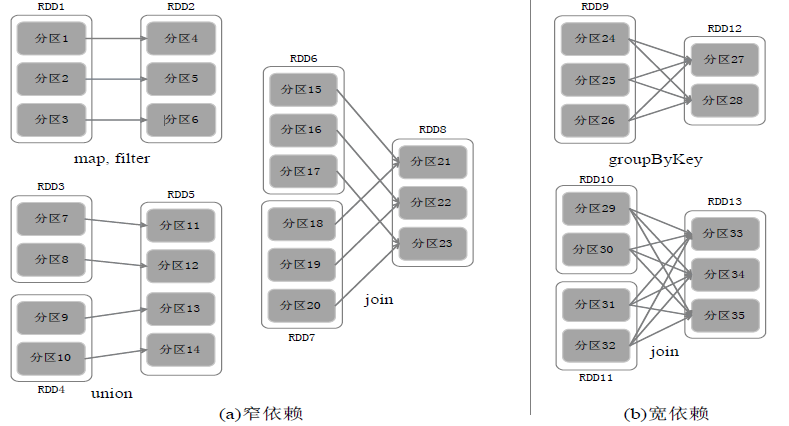
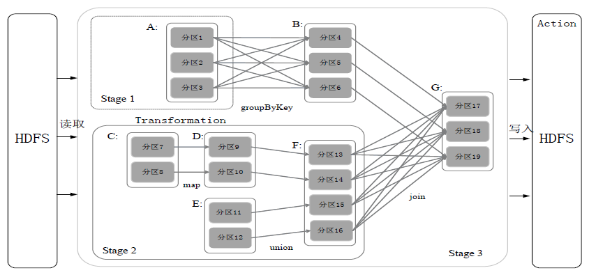
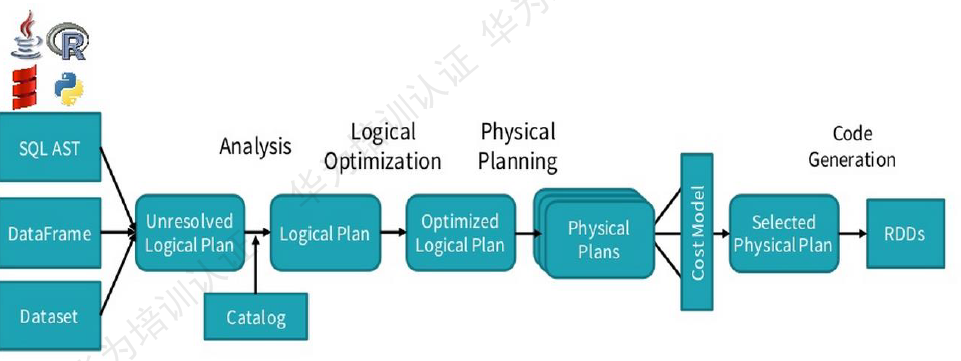
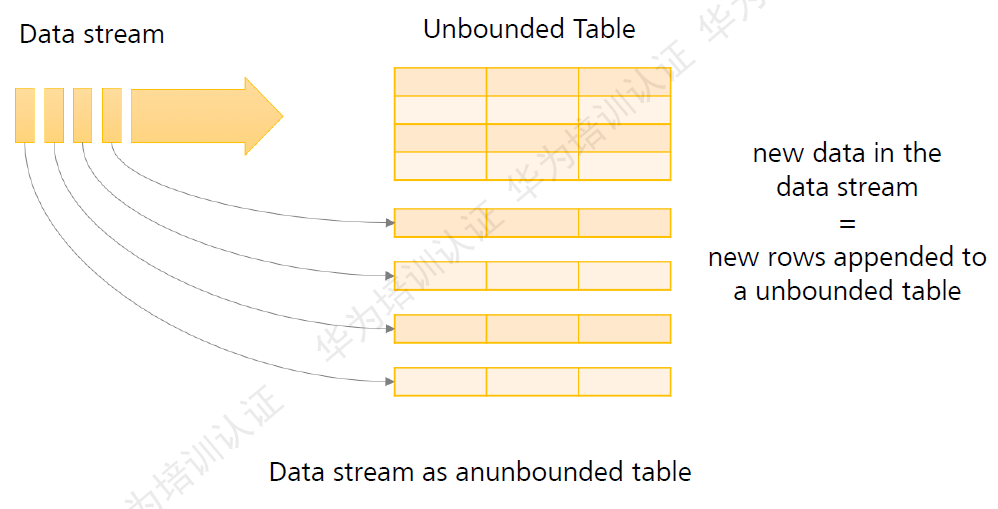
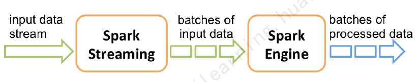

# Spark
* Spark是一个基于内存的分布式批处理引擎
* 由AMP LAB贡献到Apache社区的开源项目，是AMP大数据栈的基础组件
* Spark是一站式解决方案，集批处理、实时流计算、交互式查询、图计算与机器学习与一体

> **基本概念**
> * RDD：是Resillient Distributed Dataset（弹性分布式数据集）的简称，是分布式内存的一个抽象概念，提供了一种高度受限的共享内存模型
> 
>     * 窄依赖表现为一个父RDD的分区对应于一个子RDD的分区或多个父RDD的分区对应于一个子RDD的分区.
>     * 宽依赖则表现为存在一个父RDD的一个分区对应一个子RDD的多个分区
> * DAG：是Directed Acyclic Graph（有向无环图）的简称，反映RDD之间的依赖关系
> * Executor：是运行在工作节点（WorkerNode）的一个进程，负责运行Task
> * Application：用户编写的Spark应用程序
> * Task：运行在Executor上的工作单元
> * Job：一个Job包含多个RDD及作用于相应RDD上的各种操作
> * Stage：是Job的基本调度单位，一个Job会分为多组Task，每组Task被称为Stage，或者也被称为TaskSet，代表了一组关联的、相互之间没有Shuffle依赖关系的任务组成的任务集
> 

> **部署方式**
> * Standalone（类似于MapReduce1.0，slot为资源分配单位）
> * Spark on Mesos（和Spark有血缘关系，更好支持Mesos）
> * Spark on YARN

## Spark SQL

> * DataSet：由特定域的对象组成的强类型集合，可通过功能或关系操作并行转换其中的对象。DataSet以Catalyst逻辑执行计划表示，并且数据以编码的二进制形式存储，不需要反序列化就可以执行sort、filter、shuffle等操作。DataSet是“懒惰的”，只在执行action操作时触发计算。当执行action操作时，Spark用查询优化程序来优化逻辑计划，并生成一个高效的并行分布式的物理计划
> * DataFrame：指定列名称的DataSet。DataFrame是Dataset[Row]的特例

## Spark Structured Streaming

Structured Streaming是构建在Spark SQL引擎上的流式数据处理引擎。可以像使用静态RDD数据那样编写流式计算过程。当流数据连续不断的产生时，SPark SQL将会增量的、持续不断的处理这些数据，并将结果更新到结果集中

## Spark Streaming

Spark Streaming计算基于DStream，将流式计算分解成一系列短小的批处理作业。Spark引擎将数据生成最终结果数据