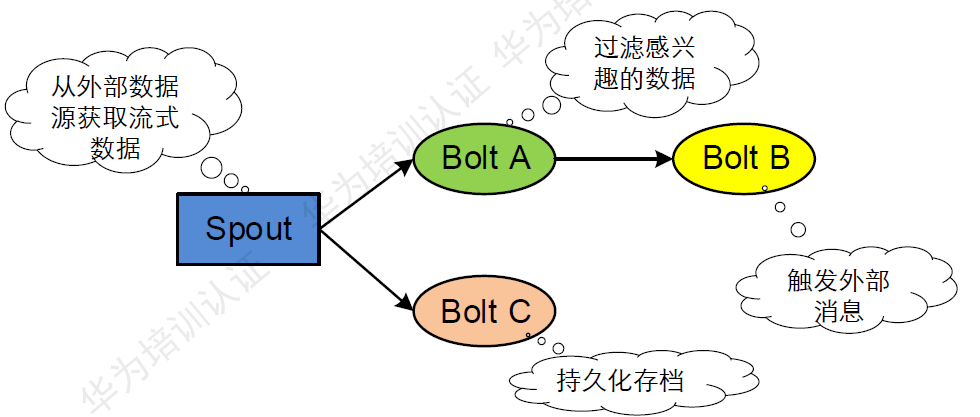
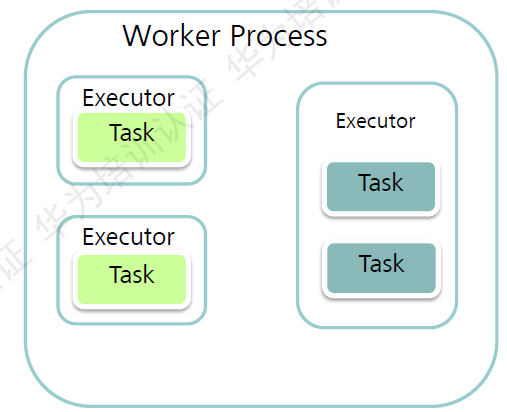
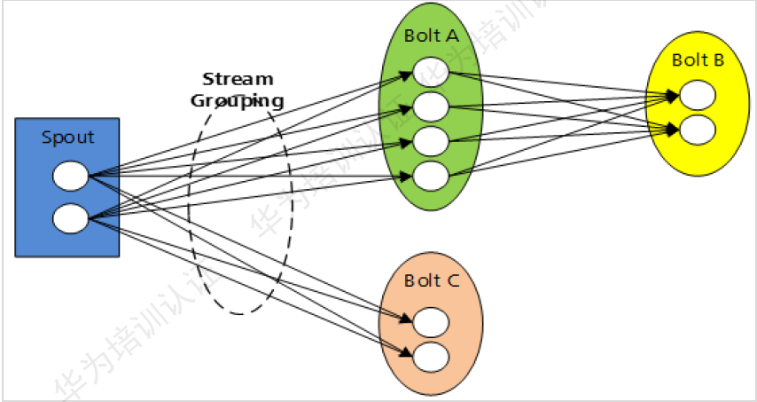
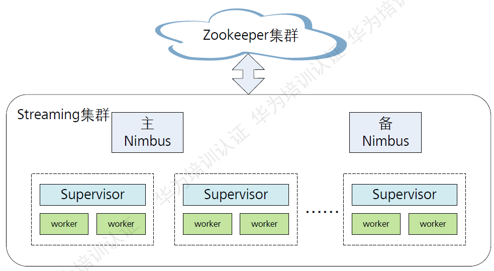
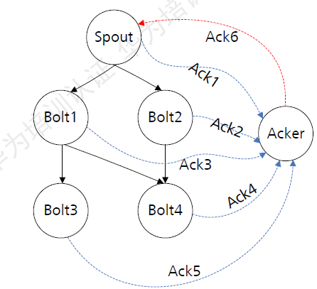

# Storm
一个免费、开源的分布式实时计算系统，Storm对于实时计算的意义类似于Hadoop对于批处理的意义，Storm可以简单、高效、可靠地处理流数据，并支持多种编程语言

## 基本概念
Storm集群采用“Master—Worker”的节点方式
> * Topology：Streaming中运行的一个实时应用程序，一个Topology是由一组Spout组件(数据源)和Bolt组件（逻辑处理）通过Stream Groupings进行连接的有向无环图（DAG）
> 
> * Nimbus：运行在Master上，负责在集群范围内分发代码，为Worker分配任务和监测故障
> * Supervisor：负责接收Nimbus分配的任务，启动和停止属于自己管理的worker进程
> * Worker：Topology运行时的物理进程。每个Worker是一个JVM进程
> 
>     * 在一个单独的Worker进程中会运行一个或多个Executor线程。每个Executor只能运Spout或者Bolt中的一个或多个Task实例
>     * Task：Worker中每一个Spout/Bolt的线程称为一个Task，是最终完成数据处理的实体单元
>     
> * Spout：Storm认为每个Stream都有一个源头，并把这个源头抽象为Spout。在一个Topology中产生源数据流的组件。通常Spout会从外部数据源（队列、数据库等）读取数据，然后封装成Tuple形式，发送到Stream中。Spout是一个主动的角色，在接口内部有个nextTuple函数，Storm框架会不停的调用该函数。
> * Bolt：在一个Topology中接收数据后然后执行处理的组件
> * Stream Groupings：用于告知Topology如何在两个组件间（如Spout和Bolt之间，或者不同的Bolt之间）进行Tuple的传送。每一个Spout和Bolt都可以有多个分布式任务，一个任务在什么时候、以什么方式发送Tuple就是由Stream Groupings来决定的
>     * ShuffleGrouping：随机分组，随机分发Stream中的Tuple，保证每个Bolt的Task接收Tuple数量大致一致
>     * FieldsGrouping：按照字段分组，保证相同字段的Tuple分配到同一个Task中
>     * AllGrouping：广播发送，每一个Task都会收到所有的Tuple
>     * GlobalGrouping：全局分组，所有的Tuple都发送到同一个Task中
>     * NonGrouping：不分组，和ShuffleGrouping类似，当前Task的执行会和它的被订阅者在同一个线程中执行
>     * DirectGrouping：直接分组，直接指定由某个Task来执行Tuple的处理
> * Tuple：Streaming的核心数据结构，是消息传递的基本单元，不可变Key-Value对，这些Tuple会以一种分布式的方式进程创建和处理
> * Stream：Storm将流数据Stream描述成一个无限的Tuple序列，这些Tuple序列会以分布式的方式并行地创建和处理。即无界的Tuple序列
> * Zookeeper：为Streaming服务中各自进程提供分布式的协作服务、主备Nimbus、Supervisor、Worker将自己的信息注册到Zookeeper中，Nimbus据此感知各个角色的监控状态

## 工作流程
> 1. 客户端提交Topology
> 2. Nimbus将Topology进行分片，分成Task，分配给相应的Supervisor，并将Task和Supervisor相关 的信息提交到Zookeeper集群上
> 3. Supervisor从zookeeper上获取分配的任务，并启动Worker
> 4. Worker进程执行具体的任务

## 集群HA

Nimbus HA的实现是使用Zookeeper分布式锁，通过主备间争抢模式完成的Leader选举和主备切换。主备Nimbus之间会周期性的同步元数据，保证在发生主备切换后拓扑数据不丢失，业务不受损。

## 消息可靠性
|可靠级别|处理机制|说明|
|:---|:---|:---|
|最多一次|无|吞吐量最大，适用于消息可靠性较低的场景|
|最少一次|Ack机制|吞吐量较低，要求数据被完整处理，适用于消息可靠性要求高的场景|
|精确一次|Trident|Trident是Streaming提供的特殊的事务性API，吞吐量最低|

## Ack机制

> 1. 一个Spout发送一个Tuple时，会通知Acker一个新的根消息产生了，Acker会创建一个新的Tuple tree，并初始化校验和为0.
> 2. Bolt发送消息时间向Acker发送anchor tuple，刷新tuple tree，并在发送成功后向Acker反馈结果。如果成功则重新刷新校验和，如果失败则Acker会立即通知Spout处理失败。
> 3. 当Tuple tree被完成吹了（校验和为0），Acker会通知Spout处理成功。
> 4. Spout提供ack()和Fail()接口方法用户处理Acker的反馈结果，需要用户实现。一般在fail()方法中实现消息重发逻辑