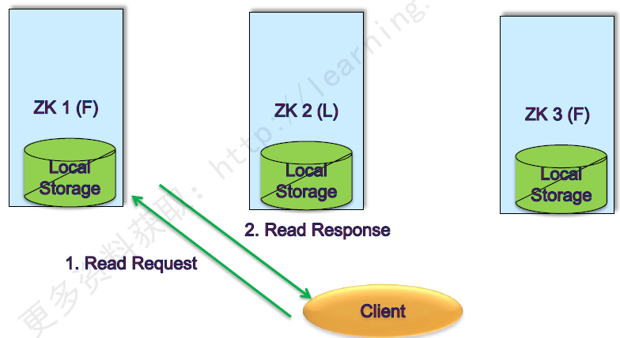
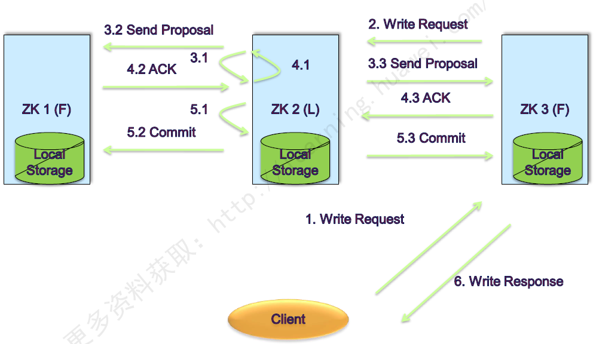

# ZooKeeper
ZooKeeper是一个分布式的，开放源码的分布式应用程序协调服务。主要是用来解决分布式应用中经常遇到的一些数据管理问题，提供分布式、高可用性的协调服务能力

## znode
> * PERSISTENT（持久化目录节点）：客户端与zookeeper断开连接后，该节点依旧存在
> * PERSISTENT_SEQUENTIAL（持久化顺序编号目录节点）：客户端与zookeeper断开连接后，该节点依旧存在，只是Zookeeper给该节点名称进行顺序编号
> * EPHEMERAL（临时目录节点）：客户端与zookeeper断开连接后，该节点被删除
> * EPHEMERAL_SEQUENTIAL（临时顺序编号目录节点）：客户端与zookeeper断开连接后，该节点被删除，只是Zookeeper给该节点名称进行顺序编号

## 工作原理
> Zookeeper的核心是原子广播，这个机制保证了各个Server之间的同步。实现这个机制的协议叫做Zab协议。Zab协议有两种模式，它们分别是恢复模式（选主）和广播模式（同步）。当服务启动或者在领导者崩溃后，Zab就进入了恢复模式，当领导者被选举出来，且大多数Server完成了和 leader的状态同步以后，恢复模式就结束了。状态同步保证了leader和Server具有相同的系统状态。为了保证事务的顺序一致性，zookeeper采用了递增的事务id号（zxid）来标识事务。所有的提议（proposal）都在被提出的时候加上了zxid。实现中zxid是一个64位的数字，它高32位是epoch用来标识leader关系是否改变，每次一个leader被选出来，它都会有一个新的epoch，标识当前属于那个leader的统治时期。低32位用于递增计数
 
## 读与写
> * 读：客户端无论连接哪个server，获取的均是同一个视图。所以，读操作可在客户端与任意节点间完成
>
> * 写：客户端可以向任意一个Server提出写的请求，然后这个server会将这个请求发送给ZooKeeper 的 leader，Leader在获取写请求以后，会向所有节点发送这条写的请求，询问其他节点是否可以执行这个写的操作。Follower节点会根据自身的情况给出反馈信息，Leader根据收到的反馈信息，如果同意写的信息超过半数，那么就执行写操作。如果同意写的票数少于半数，那么就不执行写操作。如果要执行写操作,Leader最后会将投票结果反馈给各个Follower，然后完成写的操作，每个Follower节点会同步Leader节点的数据。最后整个写的操作就完成了
> 