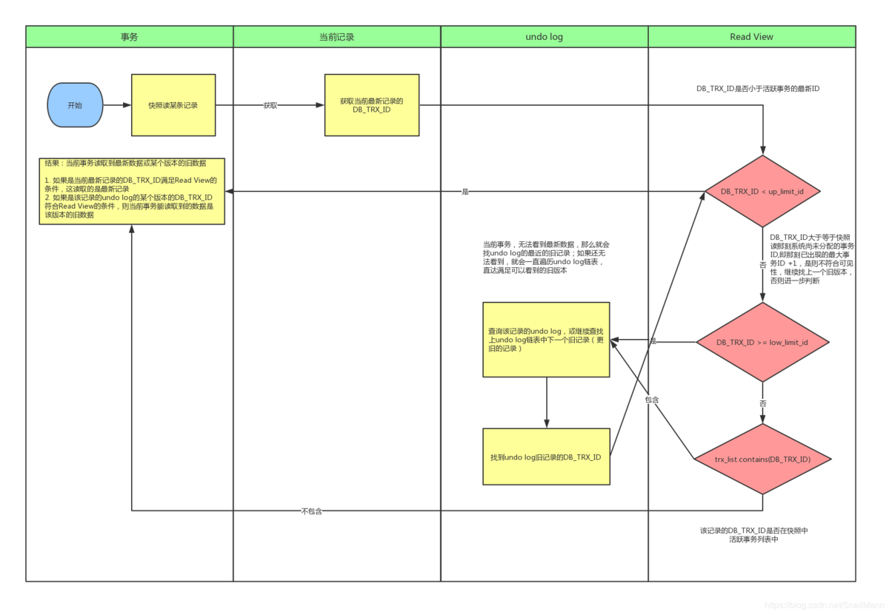

# MySQL

## 为什么B+树更适合做数据库索引
* B+树的磁盘读写代价更低：B+树的内部节点并没有指向关键字具体信息的指针，因此其内部节点相对B树更小，如果把所有同一内部节点的关键字存放在同一盘块中，那么盘块所能容纳的关键字数量也越多，一次性读入内存的需要查找的关键字也就越多，相对IO读写次数就降低了。
* B+树的查询效率更加稳定：由于非终结点并不是最终指向文件内容的结点，而只是叶子结点中关键字的索引。所以任何关键字的查找必须走一条从根结点到叶子结点的路。所有关键字查询的路径长度相同，导致每一个数据的查询效率相当。
* 由于B+树的数据都存储在叶子结点中，分支结点均为索引，方便扫库，只需要扫一遍叶子结点即可，但是B树因为其分支结点同样存储着数据，我们要找到具体的数据，需要进行一次中序遍历按序来扫，所以B+树更加适合在区间查询的情况，所以通常B+树用于数据库索引

## 存储引擎
### MyISAM
> * frm文件：存储表的结构
> * MYD文件：存储表具体记录的数据
> * MYI文件：存储索引
> 
> 

### InnoDB
> * frm文件：存储表的结构
> * IBD文件：存储数据和索引
> 
> 

|&nbsp;|InnoDB|MyISAM|
|:---|:---|:---|
|存储限制|64TB|256TB|
|支持事务|Yes|No|
|支持全文索引|No|Yes|
|支持B树索引|Yes|Yes|
|支持hash索引|No|No|
|支持集群索引|Yes|No|
|支持数据索引|Yes|No|
|支持数据压缩|No|Yes|
|空间利用率|高|低|
|插入数据的速度|低|高|
|支持外键|Yes|No|

## 聚簇索引、非聚簇索引
> 聚簇索引的叶子节点就是数据节点，而非聚簇索引的叶子节点仍然是索引节点，只不过有指向对应数据块的指针
> * MyISAM的是非聚簇索引，B+Tree的叶子节点上的data，并不是数据本身，而是数据存放的地址。主索引和辅助索引没啥区别，只是主索引中的key一定得是唯一的。这里的索引都是非聚簇索引。非聚簇索引的两棵B+树看上去没什么不同，节点的结构完全一致只是存储的内容不同而已，主键索引B+树的节点存储了主键，辅助键索引B+树存储了辅助键。表数据存储在独立的地方，
这两颗B+树的叶子节点都使用一个地址指向真正的表数据，对于表数据来说，这两个键没有任何差别。
> * InnoDB使用的是聚簇索引，将主键组织到一棵B+树中，而行数据就储存在叶子节点上，若使用"where id = 14"这样的条件查找主键，则按照B+树的检索算法即可查找到对应的叶节点，之后获得行数据。若对Name列进行条件搜索，则需要两个步骤：第一步在辅助索引B+树中检索Name，到达其叶子节点获取对应的主键。第二步使用主键在主索引B+树种再执行一次B+树检索操作，最终到达叶子节点即可获取整行数据

## 事务隔离
* 脏读：事务A读取了事务B更新的数据，然后B回滚操作，那么A读取到的数据是脏数据
* 不可重复读：事务 A 多次读取同一数据，事务 B 在事务A多次读取的过程中，对数据作了更新并提交，导致事务A多次读取同一数据时，结果 不一致。
* 幻读：系统管理员A将数据库中所有学生的成绩从具体分数改为ABCDE等级，但是系统管理员B就在这个时候插入了一条具体分数的记录，当系统管理员A改结束后发现还有一条记录没有改过来，就好像发生了幻觉一样，这就叫幻读

|事务隔离级别|脏读|不可重复读取|幻读|
|-------|:---|:---|:---|
|读未提交（read-uncommitted）|是|是|是|
|不可重复读（read-committed）|否|是|是|
|可重复读（repeatable-read）|否|否|是|
|串行化（serializable）|否|否|否|

## MVCC
多版本控制器，其特点就是在同一时间，不同事务可以读取到不同版本的数据，从而去解决脏读和不可重复读的问题。其只在REPEATABLE READ（可重复读）和READ COMMITTED（已读提交）这俩种隔离级别下适用

### 原理
主要是依赖记录中的3个隐式字段，undo日志 ，Read View来实现的
> **隐藏字段**
> * DB_TRX_ID（6 byte）：最近修改(修改/插入)事务ID，记录创建这条记录/最后一次修改该记录的事务ID
> * DB_ROLL_PTR（7 byte）：回滚指针，指向这条记录的上一个版本（存储于rollback segment里）
> * DB_ROW_ID（6 byte）：隐含的自增ID（隐藏主键），如果数据表没有主键，InnoDB会自动以DB_ROW_ID产生一个聚簇索引
> * 实际还有一个删除flag隐藏字段, 既记录被更新或删除并不代表真的删除，而是删除flag变了

> **undo日志**
> * insert undo log：代表事务在insert新记录时产生的undo log, 只在事务回滚时需要，并且在事务提交后可以被立即丢弃
> * update undo log：事务在进行update或delete时产生的undo log; 不仅在事务回滚时需要，在快照读时也需要；所以不能随便删除，只有在快速读或事务回滚不涉及该日志时，对应的日志才会被purge线程统一清除

> **Read View（读视图）**
> * 事务列表：一个数值列表，用来维护Read View生成时刻系统正活跃的事务ID
> * up_limit_id：记录trx_list列表中事务ID最小的ID
> * low_limit_id：ReadView生成时刻系统尚未分配的下一个事务ID，也就是目前已出现过的事务ID的最大值+1

### 流程
