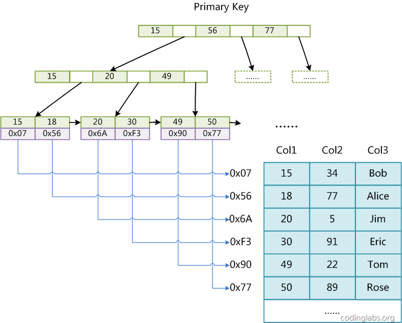
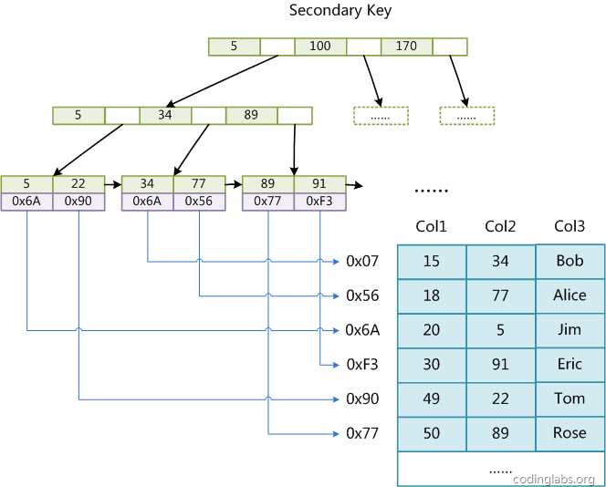
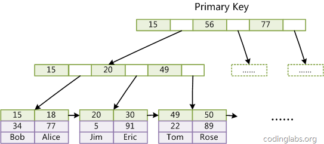
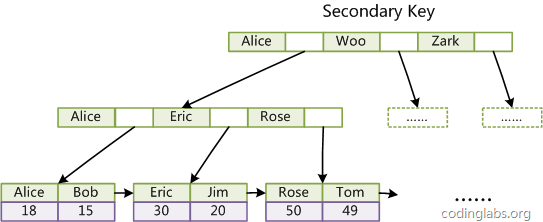
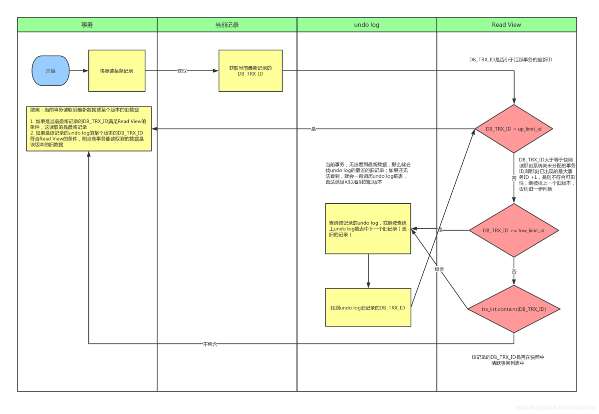

# MySQL

MySQL 是一种关系型数据库，主要用于持久化存储我们的系统中的一些结构化的数据

## 为什么B+树更适合做数据库索引
* B+树的磁盘读写代价更低：B+树的内部节点并没有指向关键字具体信息的指针，因此其内部节点相对B树更小，如果把所有同一内部节点的关键字存放在同一盘块中，那么盘块所能容纳的关键字数量也越多，一次性读入内存的需要查找的关键字也就越多，相对IO读写次数就降低了。
* B+树的查询效率更加稳定：由于非终结点并不是最终指向文件内容的结点，而只是叶子结点中关键字的索引。所以任何关键字的查找必须走一条从根结点到叶子结点的路。所有关键字查询的路径长度相同，导致每一个数据的查询效率相当。
* 由于B+树的数据都存储在叶子结点中，分支结点均为索引，方便扫库，只需要扫一遍叶子结点即可，但是B树因为其分支结点同样存储着数据，我们要找到具体的数据，需要进行一次中序遍历按序来扫，所以B+树更加适合在区间查询的情况，所以通常B+树用于数据库索引

## 存储引擎
### MyISAM
> * frm文件：存储表的结构
> * MYD文件：存储表具体记录的数据
> * MYI文件：存储索引
> 
> 

### InnoDB
> * frm文件：存储表的结构
> * IBD文件：存储数据和索引
> 
> 

|&nbsp;|InnoDB|MyISAM|
|:---|:---|:---|
|存储限制|64TB|256TB|
|支持事务|Yes|No|
|支持全文索引|No|Yes|
|支持B树索引|Yes|Yes|
|支持hash索引|No|No|
|支持集群索引|Yes|No|
|支持数据索引|Yes|No|
|支持数据压缩|No|Yes|
|空间利用率|高|低|
|插入数据的速度|低|高|
|支持外键|Yes|No|

## 聚簇索引、非聚簇索引
> 聚簇索引的叶子节点就是数据节点，而非聚簇索引的叶子节点仍然是索引节点，只不过有指向对应数据块的指针
> * MyISAM的是非聚簇索引，B+Tree的叶子节点上的data，并不是数据本身，而是数据存放的地址。主索引和辅助索引没啥区别，只是主索引中的key一定得是唯一的。这里的索引都是非聚簇索引。非聚簇索引的两棵B+树看上去没什么不同，节点的结构完全一致只是存储的内容不同而已，主键索引B+树的节点存储了主键，辅助键索引B+树存储了辅助键。表数据存储在独立的地方，
这两颗B+树的叶子节点都使用一个地址指向真正的表数据，对于表数据来说，这两个键没有任何差别。
> * InnoDB使用的是聚簇索引，将主键组织到一棵B+树中，而行数据就储存在叶子节点上，若使用"where id = 14"这样的条件查找主键，则按照B+树的检索算法即可查找到对应的叶节点，之后获得行数据。若对Name列进行条件搜索，则需要两个步骤：第一步在辅助索引B+树中检索Name，到达其叶子节点获取对应的主键。第二步使用主键在主索引B+树种再执行一次B+树检索操作，最终到达叶子节点即可获取整行数据

## 事务隔离
* 脏读：事务A读取了事务B更新的数据，然后B回滚操作，那么A读取到的数据是脏数据
* 不可重复读：事务 A 多次读取同一数据，事务 B 在事务A多次读取的过程中，对数据作了更新并提交，导致事务A多次读取同一数据时，结果 不一致。
* 幻读：系统管理员A将数据库中所有学生的成绩从具体分数改为ABCDE等级，但是系统管理员B就在这个时候插入了一条具体分数的记录，当系统管理员A改结束后发现还有一条记录没有改过来，就好像发生了幻觉一样，这就叫幻读

|事务隔离级别|脏读|不可重复读取|幻读|
|-------|:---|:---|:---|
|读未提交（read-uncommitted）|是|是|是|
|不可重复读（read-committed）|否|是|是|
|可重复读（repeatable-read）|否|否|是|
|串行化（serializable）|否|否|否|

## MVCC
多版本控制器，其特点就是在同一时间，不同事务可以读取到不同版本的数据，从而去解决脏读和不可重复读的问题。其只在REPEATABLE READ（可重复读）和READ COMMITTED（已读提交）这俩种隔离级别下适用

### 原理
主要是依赖记录中的3个隐式字段，undo日志 ，Read View来实现的
> **隐藏字段**
> * DB_TRX_ID（6 byte）：最近修改(修改/插入)事务ID，记录创建这条记录/最后一次修改该记录的事务ID
> * DB_ROLL_PTR（7 byte）：回滚指针，指向这条记录的上一个版本（存储于rollback segment里）
> * DB_ROW_ID（6 byte）：隐含的自增ID（隐藏主键），如果数据表没有主键，InnoDB会自动以DB_ROW_ID产生一个聚簇索引
> * 实际还有一个删除flag隐藏字段, 既记录被更新或删除并不代表真的删除，而是删除flag变了

> **undo日志**
> * insert undo log：代表事务在insert新记录时产生的undo log, 只在事务回滚时需要，并且在事务提交后可以被立即丢弃
> * update undo log：事务在进行update或delete时产生的undo log; 不仅在事务回滚时需要，在快照读时也需要；所以不能随便删除，只有在快速读或事务回滚不涉及该日志时，对应的日志才会被purge线程统一清除

> **Read View（读视图）**
> * 事务列表：一个数值列表，用来维护Read View生成时刻系统正活跃的事务ID
> * up_limit_id：记录trx_list列表中事务ID最小的ID
> * low_limit_id：ReadView生成时刻系统尚未分配的下一个事务ID，也就是目前已出现过的事务ID的最大值+1

### 流程

## 执行计划分析
执行计划通常用于 SQL 性能分析、优化等场景。通过 EXPLAIN 的结果，可以了解到如数据表的查询顺序、数据查询操作的操作类型、哪些索引可以被命中、哪些索引实际会命中、每个数据表有多少行记录被查询等信息。需要注意的是EXPLAIN 语句并不会真的去执行相关的语句，而是通过查询优化器对语句进行分析，找出最优的查询方案，并显示对应的信息；MySQL 8.0.18 引入了 EXPLAIN ANALYZE，它会真正执行查询并输出每个步骤的实际耗时与行数，比标准 EXPLAIN 的估算数据更可靠，适合在测试环境深度排查慢查询。

### 执行计划结果字段分析
> **id**
> 
> SELECT标识符，用于标识每个SELECT语句的执行顺序
> * id相同：从上往下依次执行（通常出现在多表JOIN场景）;id 不同：id 值越大，执行优先级越高（子查询先于外层查询执行）;id 为 NULL：表示这是 UNION RESULT 或 DERIVED 表的结果集，不需要单独执行查询

> **select_type**
> 
> 查询的类型，主要用于区分普通查询、联合查询、子查询等复杂的查询，常见的值有
> * SIMPLE：简单查询，不包含UNION或者子查询
> * PRIMARY：查询中如果包含子查询或其他部分，外层的SELECT将被标记为PRIMARY
> * SUBQUERY：子查询中的第一个 SELECT
> * UNION：在UNION语句中，UNION之后出现的SELECT
> * DERIVED：在FROM中出现的子查询将被标记为DERIVED
> * UNION RESULT：UNION查询的结果

> **table**
> 
> 查询用到的表名，每行都有对应的表名，表名除了正常的表之外，也可能是以下列出的值
> * <unionM,N>: 本行引用了id为M和N的行的UNION结果
> * <derivedN>: 本行引用了id为N的表所产生的派生表结果。派生表有可能产生自FROM语句中的子查询
> * <subqueryN>: 本行引用了id为N的表所产生的物化子查询结果

> **type（重要）**
> 
> 查询执行的类型，描述了查询是如何执行的。从最优到最差的排序为：system > const > eq_ref > ref > fulltext > ref_or_null > index_merge > unique_subquery > index_subquery > range > index > ALL
> 
> 性能判断经验法则
> * 优秀（至少达到）：system、const、eq_ref、ref、range
> * 需关注：index_merge、index（全索引扫描，大数据量下仍有性能风险）
> * 需优化：ALL（全表扫描）
> 
> 常见的几种类型具体含义如下
> * system：表中只有一行记录（或者是空表），且存储引擎能够精确统计行数。适用于 MyISAM、Memory、InnoDB（当表只有 1 行时，InnoDB 会优化为 const）等引擎。是 const 访问类型的特例
> * const：表中最多只有一行匹配的记录，一次查询就可以找到，常用于使用主键或唯一索引的所有字段作为查询条件
> * eq_ref：当连表查询时，前一张表的行在当前这张表中只有一行与之对应。是除了 system 与 const 之外最好的 join 方式，常用于使用主键或唯一非空索引的所有字段作为连表条件（严格保证一对一匹配）
> * ref：使用普通索引作为查询条件，查询结果可能找到多个符合条件的行（与 eq_ref 的区别：一个驱动行可能匹配多个被驱动行）
> * index_merge：当 WHERE 子句包含多个范围条件，且每个条件可以使用不同索引时，MySQL 会合并多个索引的扫描结果。key 列列出使用的索引，Extra 列显示合并算法
>   * Using union(...)：对多个索引结果取并集（OR 条件）
>   * Using sort_union(...)：先对索引结果排序再取并集（OR 条件，索引列非有序）
>   * Using intersection(...)：对多个索引结果取交集（AND 条件）
> * range：对索引列进行范围查询，执行计划中的 key 列表示哪个索引被使用了
> * index：Full Index Scan，查询遍历了整棵索引树。与 ALL（全表扫描）类似，但通常开销更低：索引记录的体积远小于完整行数据，读取相同行数所需的 I/O 页数更少；若同时满足覆盖索引条件，还可避免回表。但在超大表（亿级以上）上，全索引扫描同样可能产生大量 I/O，不可因 type 级别高于 ALL 就忽视其代价
> * ALL：全表扫描

> **possible_keys**
> 
> possible_keys列表示MySQL执行查询时可能用到的索引。如果这一列为NULL，则表示没有可能用到的索引；这种情况下，需要检查WHERE语句中所使用的列，看是否可以通过给这些列中某个或多个添加索引的方法来提高查询性能

> **key（重要）**
> 
> key列表示MySQL实际使用到的索引。如果为NULL，则表示未用到索引

> **key_len**
> 
> key_len列表示MySQL实际使用的索引的最大长度；当使用到联合索引时，有可能是多个列的长度和。在满足需求的前提下越短越好。如果key列显示NULL ，则key_len列也显示NULL

> **rows**
> 
> rows 列表示根据表统计信息及索引选用情况，估算出找到所需记录需要读取的行数，数值越小越好（需要注意的是，该值是估算值而非精确值）

> **filtered**
> 
> filtered列表示存储引擎返回的数据在Server层经WHERE条件过滤后，估算留存的记录占比（百分比，0～100）。计算公式为：filtered=(条件过滤后的行数/存储引擎返回的行数)×100
> 
> 解读规则
> * 当filtered=100：存储引擎返回的所有行都满足WHERE条件（理想情况）
> * 当filtered<100：部分行被Server层过滤掉，说明索引未能覆盖所有查询条件
> * JOIN 场景：优化器用rows×(filtered/100)估算当前表传递给下一张表的行数（扇出）

> **Extra（重要）**
> 
> 这列包含了 MySQL 解析查询的额外信息，通过这些信息，可以更准确的理解 MySQL 到底是如何执行查询的。常见的值如下
> * Using filesort：MySQL无法利用索引完成ORDER BY或GROUP BY的排序要求，需要在返回结果集后额外执行一次排序操作。当结果集大小在sort_buffer_size以内时，排序在内存中完成；超出则借助临时磁盘文件。"filesort"是历史遗留名称，并不代表一定产生磁盘I/O
> * Using temporary：MySQL需要创建临时表来存储查询的结果，常见于ORDER BY和GROUP BY
> * Using index：表明查询使用了覆盖索引，不用回表，查询效率非常高
> * Using index condition：表示查询优化器选择使用了索引条件下推这个特性
> * Using where：MySQL Server 层对存储引擎返回的行应用了额外的 WHERE 条件过滤。即使已命中索引（如 type=ref），若索引只能满足部分查询条件，剩余条件仍需在 Server 层过滤，此时同样会出现 Using where
> * Using join buffer (Block Nested Loop)：连表查询时，被驱动表未使用索引，MySQL会先将驱动表数据读入 join buffer，再遍历被驱动表进行匹配（复杂度 O(N×M)）
> * Using join buffer (hash join)：MySQL 8.0.18引入了Hash Join算法，仅用于等值JOIN（如 t1.id = t2.id），8.0.20起默认替代BNL。Hash Join复杂度为构建阶段O(N)+探测阶段O(M)，比BNL的O(N×M)更高效
