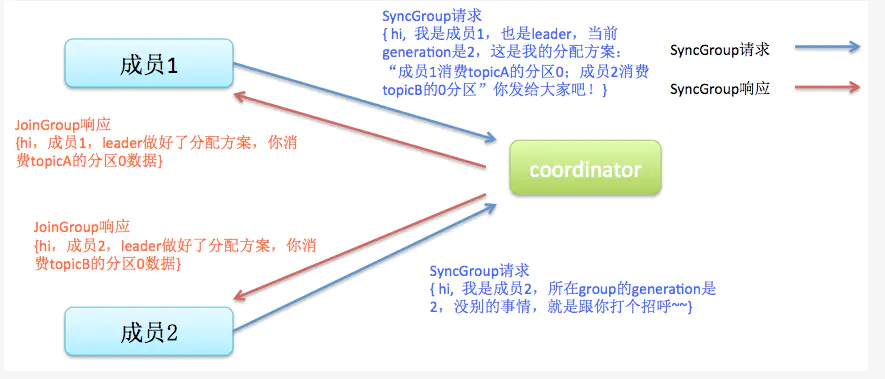

# Kafka

##Producer
* 设置ack(0, 1, all)
* 设置retries
* 设置key，可将同一key的消息发送到指定partition

## Consumer
* 消费分区策略由partition.assignment.strategy（range、roundrobin）指定
* 设置enable.auto.commit=false，可以关闭自动提交

## Broker
* 设置replication-factor,一般为3或5
* 设置min.insync.replicas，一般为为n/2+1
* 设置unclean.leander.election.enable，默认为false（不允许从ISR队列里选举leader副本）

## Partition
* 创建一个只有1个分区的topic
* 测试这个topic的producer吞吐量和consumer吞吐量
* 假设他们的值分别是Tp和Tc,单位可以是MB/s
* 然后假设总的目标吞吐量是Tt,那么分区数=Tt/max（Tp,Tc）

## Rebalance
> 触发条件有3个
> * 组成员个数发生变化。例如有新的 consumer 实例加入该消费组或者离开组
> * 订阅Topic的个数发生变化
> * 订阅Topic的分区数发生变化
> 
> 工作过程
> * Join：这一步中，所有成员都向coordinator发送JoinGroup请求，请求加入消费组。一旦所有成员都发送了JoinGroup请求，coordinator会从中选择一个consumer担任leader的角色，并把组成员信息以及订阅信息发给leader——注意leader和coordinator不是一个概念。leader负责消费分配方案的制定
> 
> * Sync：这一步leader开始分配消费方案，即哪个consumer负责消费哪些topic的哪些partition。一旦完成分配，leader会将这个方案封装进SyncGroup请求中发给coordinator，非leader也会发SyncGroup请求，只是内容为空。coordinator接收到分配方案之后会把方案塞进SyncGroup的response中发给各个consumer。这样组内的所有成员就都知道自己应该消费哪些分区了
> 