#Redis

## 数据结构
Redis使用对象来存储键和值，对象由redisObject结构表示
```
typedef struct redisObject{
   // 类型
   unsigned type:4;
   // 编码
   unsigned encoding:4;
   // 底层数据结构的指针
   void *ptr;
} robj;
```
type属性记录对象的类型

|类型|对象类型名称|
|:---|:---|
|REDIS_STRING|字符串对象|
|REDIS_LIST|列表对象|
|REDIS_HASH|哈希对象|
|REDIS_SET|集合对象|
|REDIS_ZSET|有序集合对象|

*ptr属性指向对象的底层数据结构，而这些数据结构有encoding属性决定（之所以由encoding属性来决定对象的底层数据结构，是为了实现同一对象类型，支持不同的底层实现）

|编码常量|编码对应的底层数据结构|
|:---|:---|
|REDIS_ENCODING_INT|long类型的整数|
|REDIS_ENCODING_EMBSTR|emstr编码的简单动态字符串|
|REDIS_ENCODING_RAW|简单动态字符串|
|REDIS_ENCODING_HT|字典|
|REDIS_ENCODING_LINKEDLIST|双端链表|
|REDIS_ENCODING_ZIPLIST|压缩列表|
|REDIS_ENCODING_INTSET|整数集合|
|REDIS_ENCODING_SKIPLIST|跳跃表和字典|

## 数据类型
### string
string对应的编码类型可以是int（保存不超过long类型的整数）、raw（长度>39字节的字符串）、embstr（长度<=39字节）
> * 简单动态字符串（SDS）
> ```
> struct sdshdr {
>    // 字符串长度
>    int len;
>    // buf数组中未使用的字节数
>    int free;
>    // 字节数组，用于保存字符串
>    char buf[];
> }
> ```
> 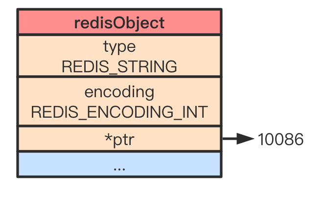
> 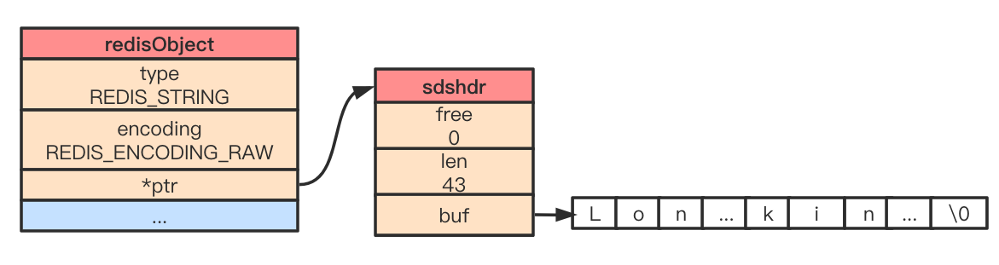
> 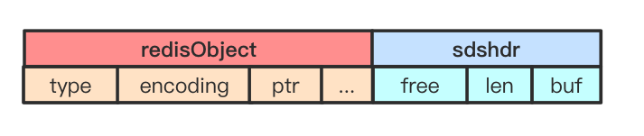

### list
对应的编码类型可以是linkedlist、ziplist（所有字符元素长度<64字节，且元素个数小于512个）
> * ListNode
> ```
> typedef struct listNode {
>    // 前置节点
>    struct listNode *prev;
>    // 后置节点
>    struct listNode *next;
>    // 节点值
>    void *value;
> } listNode;
> 
> typedef struct list {
>   // 表头节点
>   listNode *head;
>   // 表尾节点
>   listNode *tail;
>   // 链表包含的节点数量
>   unsigned long len;
>   // 节点复制函数
>   void *(*dup)(void *ptr);
>   // 节点释放函数
>   void (*free)(void *ptr);
>   // 节点对比函数
>   int (*match)(void *ptr, void *key);
> } list;
> ```
> 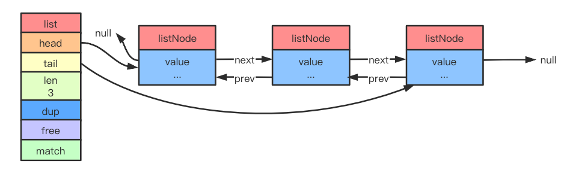
> * ziplist
> 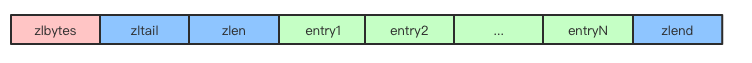

### hash
对应的编码是ziplist、hashtable
> * ziplist
> 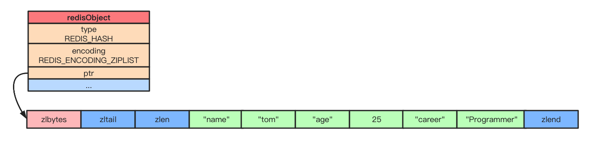
> * hashtable
> ```
> typedef struct dict {
>   // 类型特定函数
>   dictType *type;
>   // 私有数据
>   void *privdata;
>   // 哈希表
>   dictht ht[2];
>   //rehash索引
>   // 当rehash不在进行时，值为-1
>   int rehashidx;
> }
> 
> typedef struct dictht{
>   // 哈希表数组
>   dictEntry **table;
>   // 哈希表大小
>   unsigned long size;
>   // 哈希表大小掩码，用于计算索引值
>   // 总是等于 size-1
>   unsigned long sizemask;
>   // 该哈希表已有节点数量
>   unsigned long used;
> } dictht;
> 
> typedef struct dictEntry {
>   // 键
>   void *key;
>   // 值
>   union {
>       void *val;
>       unit64_t u64;
>       nit64_t s64;
>   } v;
>   // 指向下一个哈希表节点，形成链表
>   struct dictEntry *next;
> } dictEntry;
>
> ```
> 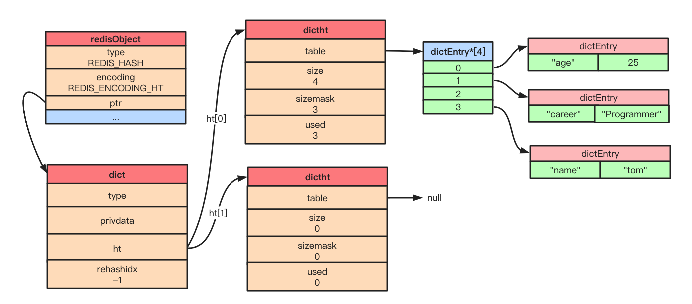
> 
### set
对应的编码是intset（保存的元素都是整数且个数<=512）、hashtable
> * intset
> ```
> typedef struct intset {
>   // 编码方式
>   uint32_t encoding;
>   // 集合包含的元素数量
>   uint32_t length;
>   // 保存元素的数组
>   int8_t contents[];
> } intset;
> ```
> 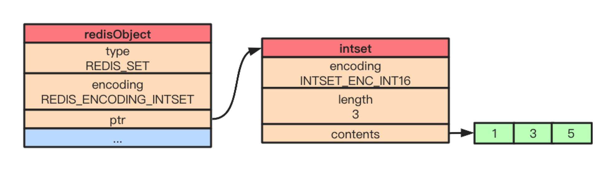
> * hashtable
> 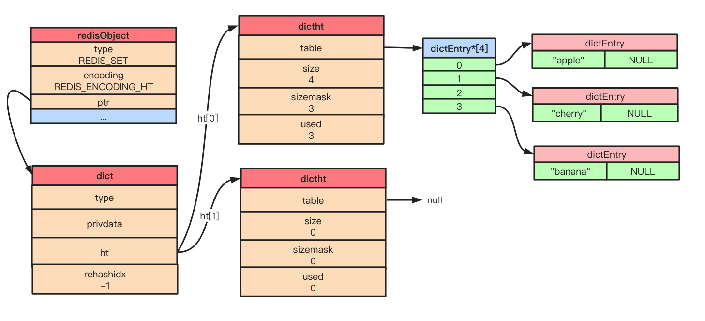

### zset
对应的编码可以是ziplist（元素个数<128，且元素长度<64字节）、skiplist
> ```
> typedef struct zset {
>   zskiplist *zs1;
>   dict *dict;
> }
> ```
> * ziplist
> 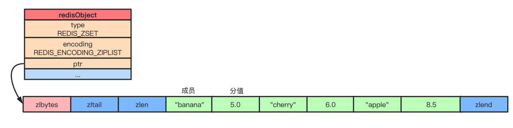
> * skiplist
> ```
> typedef struct zskiplistNode {
>   // 后退指针
>   struct zskiplistNode *backward;
>   // 分值
>   double score;
>   // 成员对象
>   robj *obj;
>   // 层
>   struct zskiplistLevel {
>       // 前进指针
>       struct zskiplistNode *forward;
>       // 跨度
>       unsigned int span;
>   } level[];
> } zskiplistNode;
> 
> typedef struct zskiplist {
>   // 表头节点和表尾节点
>   struct skiplistNode *header, *tail;
>   // 节点数量
>   unsigned long length;
>   // 最大层数
>   int level;
> } zskiplist;
> ```
> 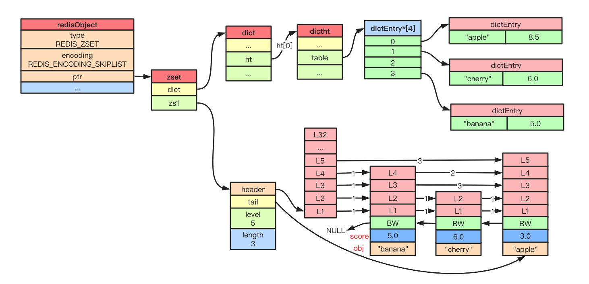

## 持久化
|&nbsp;|RDB|AOF|
|-------|:---|:---|
|启动优先级|低|高|
|体积|小|大|
|恢复速度|快|慢|
|数据安全性|丢数据|根据策略决定|
|轻重|重|轻|

## 工作流程

因此，Redis单线程是指执行命令的核心模块是单线程。

## 内存淘汰
> * noeviction（默认策略）：对于写请求不再提供服务，直接返回错误（del请求和部分特殊请求除外）
> * allkeys-lru：从所有key中使用LRU算法进行淘汰
> * volatile-lru：从设置了过期时间的key中使用LRU算法进行淘汰
> * allkeys-random：从所有key中随机淘汰数据
> * volatile-random：从设置了过期时间的key中随机淘汰
> * volatile-ttl：在设置了过期时间的key中，根据key的过期时间进行淘汰，越早过期的越优先被淘汰
>
> **以下算法在Redis 4.0后提供**
> * volatile-lfu：在设置了过期时间的key中使用LFU算法淘汰key
> * allkeys-lfu：在所有的key中使用LFU算法淘汰数据

LRU（Least Recently Used）：最近最少使用，如果一个数据在最近一段时间没有被用到，那么将来被使用到的可能性也很小，所以就可以被淘汰掉
LFU（Least Frequently Used）：根据key的最近被访问的频率进行淘汰，很少被访问的优先被淘汰，被访问的多的则被留下来

## Redis为什么快

可查看详细解释：https://www.jianshu.com/p/6cb9e96207f8

## 部署模式
### 单机
> 优点：
> * 部署简单，0成本
> * 成本低，没有备用节点，不需要其他的开支
> * 高性能，单机不需要同步数据，数据天然一致性
> 
> 缺点：
> * 可靠性保证不是很好，单节点有宕机的风险
> * 单机高性能受限于CPU的处理能力，redis是单线程的

### 主从复制
指将一台Redis服务器的数据，复制到其他的Redis服务器。前者称为主节点(master)，后者称为从节点(slave)；数据的复制是单向的，只能由主节点到从节点

> 优点：
> * 当主节点宕机，从节点作为主节点的备份可以随时顶上来
> * 扩展主节点的读能力，分担主节点读压力
> * 高可用基石：除了上述作用以外，主从复制还是哨兵模式和集群模式能够实施的基础，因此说主从复制是Redis高可用的基石
>
> 缺点：
> * 一旦主节点宕机，从节点晋升成主节点，同时需要修改应用方的主节点地址，还需要命令所有从节点去复制新的主节点，整个过程需要人工干预
> * 主节点的写能力受到单机的限制
> * 主节点的存储能力受到单机的限制

### 哨兵

> 优点：
> * 哨兵模式是基于主从模式的，所有主从的优点，哨兵模式都具有
> * 主从可以自动切换，系统更健壮，可用性更高。
> * Sentinel会不断的检查主服务器和从服务器是否正常运行。当被监控的某个Redis服务器出现问题，Sentinel通过API脚本向管理员或者其他的应用程序发送通知
>
> 缺点：
> * Redis较难支持在线扩容，对于集群，容量达到上限时在线扩容会变得很复杂

### 集群
