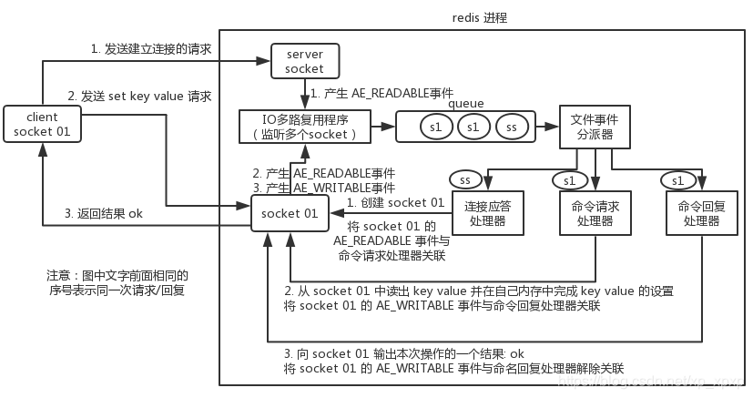
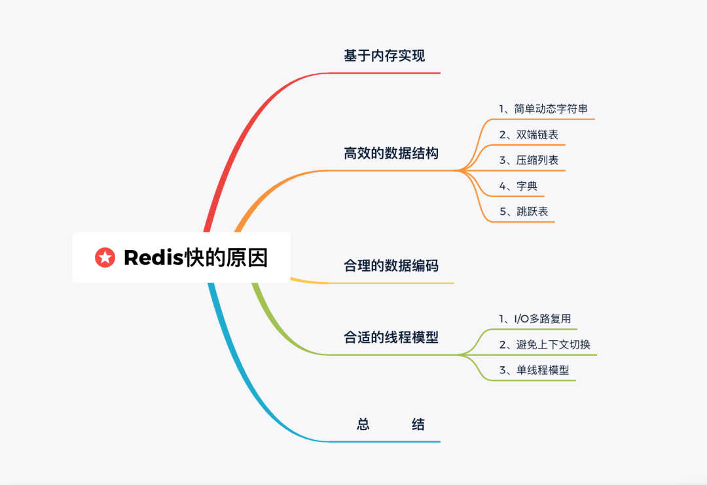

#Redis

## 数据类型
string, hash, list, set, zset

## 持久化
|&nbsp;|RDB|AOF|
|-------|:---|:---|
|启动优先级|低|高|
|体积|小|大|
|恢复速度|快|慢|
|数据安全性|丢数据|根据策略决定|
|轻重|重|轻|

## 通信流程

因此，Redis单线程是指执行命令的核心模块是单线程。

## Redis为什么快

可查看详细解释：https://www.jianshu.com/p/6cb9e96207f8