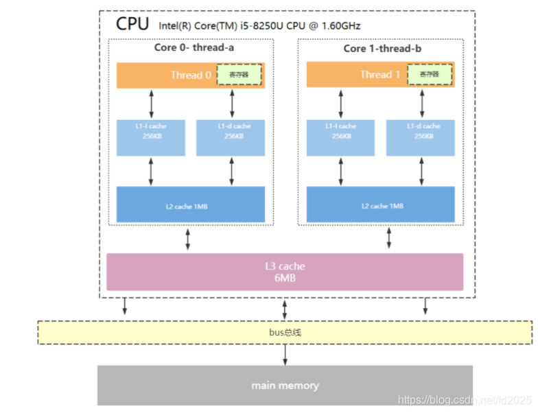
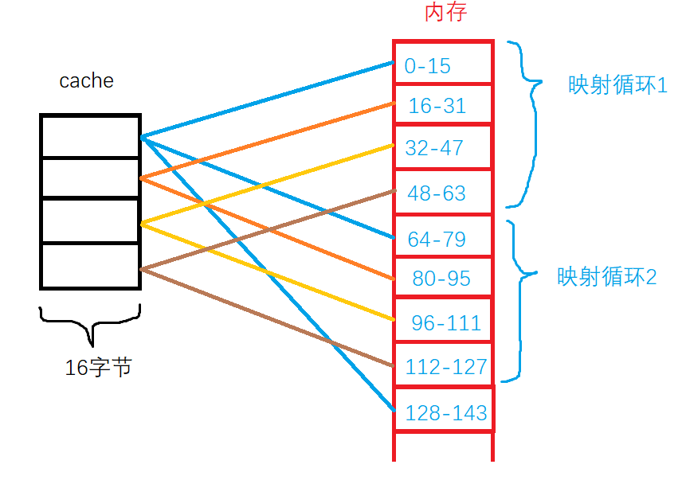
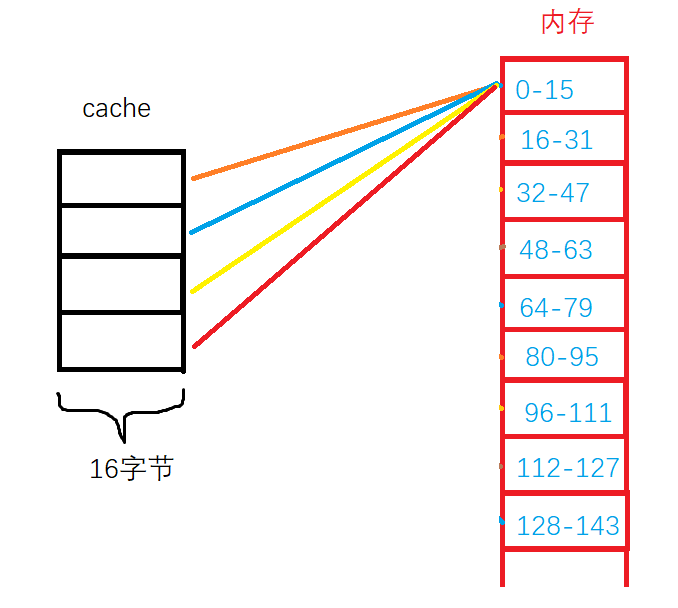
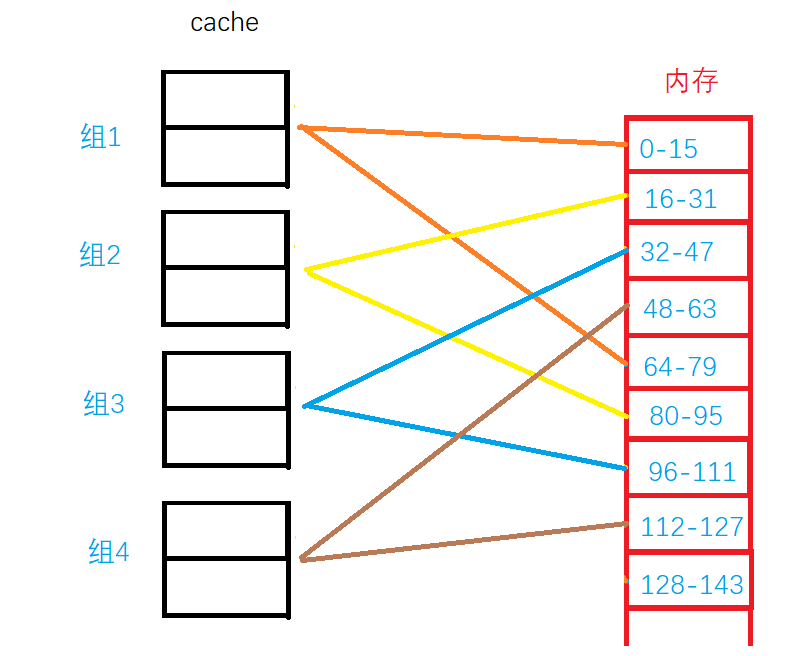

# CPU

## CPU缓存结构
CPU缓存是位于CPU与内存之间的临时数据交换器，它的容量比内存小的多但是交换速度却比内存要快得多

> * L1：分为数据缓存（L1D）和指令缓存（L1I），逻辑核独占
> * L2：物理核独占，逻辑核共享
> * L3：所有物理核共享

## 内存与缓存数据映射
> * 直接相联映射：每一个内存块都对应到一个cache行
>     * 
>     * 优点：硬件简单，容易实现
>     * 缺点：命中率低，cache的存储空间利用率低
> * 全相联映射：任意内存块，可以被映射到任意cache行
>     * 
>     * 优点：命中率较高，cache的存储空间利用率高
>     * 缺点：线路复杂，成本高，速度低
> * 组相联映射：cache分组，一个cache组包含多个cache行，而内存块以直接映射的形式，先映射到对应的组上，然后再以全连接映射的方式，在组内寻找对应到的cache行
>     * 
>     * 优点：组间采用直接映射，组内采用全相连映射。速度较快，命中率较高
>     * 缺点：命中率低，cache的存储空间利用率低